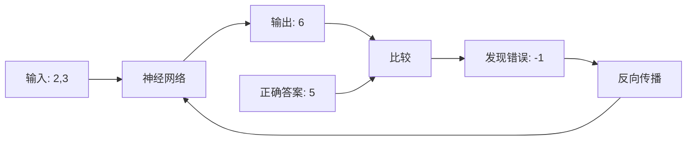

+++
title = '反向传播算法'
weight = 3
description = '深入浅出地讲解反向传播算法的原理、实现和应用，帮助你理解神经网络的学习过程。'
tags = ['机器学习', '神经网络', '反向传播', '深度学习']
categories = ['人工智能', '深度学习']
+++


让AI学会"从错误中学习"的神奇魔法

- [前言](#前言)
- [什么是反向传播？一个生动的比喻](#什么是反向传播一个生动的比喻)
  - [🏫 学校考试的故事](#-学校考试的故事)
  - [🧠 神经网络版本](#-神经网络版本)
- [为什么需要反向传播？](#为什么需要反向传播)
  - [问题的本质](#问题的本质)
- [简单神经网络示例](#简单神经网络示例)
  - [🔢 超简单的神经网络](#-超简单的神经网络)
  - [🚀 前向传播（Forward Pass）](#-前向传播forward-pass)
  - [⬅️ 反向传播（Backward Pass）](#️-反向传播backward-pass)
  - [🔧 权重更新](#-权重更新)
- [数学背后的直觉](#数学背后的直觉)
  - [🎯 链式法则：像多米诺骨牌一样的连锁反应](#-链式法则像多米诺骨牌一样的连锁反应)
  - [📊 梯度：错误的"指南针"](#-梯度错误的指南针)
- [完整的训练过程](#完整的训练过程)
- [可视化理解](#可视化理解)
  - [📈 错误随时间变化](#-错误随时间变化)
  - [🎛️ 权重变化过程](#️-权重变化过程)
- [常见问题与解答](#常见问题与解答)
  - [❓ Q1: 为什么叫"反向"传播？](#-q1-为什么叫反向传播)
  - [❓ Q2: 学习率太大或太小会怎样？](#-q2-学习率太大或太小会怎样)
  - [❓ Q3: 为什么需要多层神经网络？](#-q3-为什么需要多层神经网络)
- [实际应用中的反向传播](#实际应用中的反向传播)
  - [🖼️ 图像识别中的反向传播](#️-图像识别中的反向传播)
  - [💬 语言模型中的反向传播](#-语言模型中的反向传播)
- [反向传播的局限性与解决方案](#反向传播的局限性与解决方案)
  - [⚠️ 常见问题](#️-常见问题)
  - [🔧 现代改进技术](#-现代改进技术)
- [动手实践：构建你的第一个反向传播网络](#动手实践构建你的第一个反向传播网络)
  - [🛠️ 完整实现](#️-完整实现)
- [总结：反向传播的精髓](#总结反向传播的精髓)
  - [🎯 核心思想](#-核心思想)
  - [🌟 关键洞察](#-关键洞察)
  - [🚀 现实意义](#-现实意义)
- [延伸阅读与实践](#延伸阅读与实践)
  - [📚 推荐资源](#-推荐资源)
  - [🔬 实验建议](#-实验建议)
- [结语](#结语)

## 前言

想象一下，你在学骑自行车时，每次摔倒后都会分析"刚才是因为转弯太急？还是速度太快？"然后下次骑车时调整这些动作。这个过程就像神经网络中的反向传播算法——通过分析错误，逐步改进表现。

今天，我们将用最通俗易懂的方式，揭开这个让AI变聪明的核心算法的神秘面纱。

## 什么是反向传播？一个生动的比喻

### 🏫 学校考试的故事

让我们从一个熟悉的场景开始：

```txt
小明参加数学考试：
题目：2 + 3 = ?
小明的答案：6 (错误！)
正确答案：5

小明的"学习"过程：
1. 发现错误：我答错了！
2. 分析原因：我把加法当成了乘法
3. 调整策略：下次看到"+"号要做加法
4. 下次遇到类似题目时表现更好
```

这就是反向传播的基本思想：**从错误中学习，不断调整，逐步改进**。

### 🧠 神经网络版本



## 为什么需要反向传播？

### 问题的本质

想象神经网络是一个巨大的函数机器，有成千上万个旋钮（参数）：

```txt
🎛️ 旋钮1: 权重w1 = 0.5
🎛️ 旋钮2: 权重w2 = 0.8
🎛️ 旋钮3: 权重w3 = 1.2
... (可能有几百万个旋钮)
```

**问题**：如何调整这些旋钮，让机器给出正确答案？

**传统方法**：随机尝试 → 需要尝试无数次，几乎不可能成功

**反向传播方法**：聪明地分析每个旋钮对错误的"贡献"，有针对性地调整

## 简单神经网络示例

让我们从最简单的例子开始理解：

### 🔢 超简单的神经网络

```python
# 一个只有两个神经元的网络
# 输入 → 隐藏层 → 输出

import numpy as np

# 网络结构
"""
输入    隐藏层    输出
x1 ─┐   
    ├─→ h1 ───→ y
x2 ─┘   
"""

# 示例数据
x1, x2 = 2, 3  # 输入
target = 5     # 期望输出（2+3=5）

# 初始权重（随机的）
w1 = 0.5  # x1 到 h1 的权重
w2 = 0.8  # x2 到 h1 的权重
w3 = 1.2  # h1 到 y 的权重
```

### 🚀 前向传播（Forward Pass）

这就像信息从左到右"流动"的过程：

```python
def forward_pass():
    # 步骤1: 计算隐藏层
    h1 = x1 * w1 + x2 * w2
    print(f"隐藏层计算: h1 = {x1} × {w1} + {x2} × {w2} = {h1}")
    
    # 步骤2: 计算输出
    y = h1 * w3
    print(f"输出计算: y = {h1} × {w3} = {y}")
    
    # 步骤3: 计算错误
    error = target - y
    print(f"错误: {target} - {y} = {error}")
    
    return h1, y, error

h1, y, error = forward_pass()
```

输出：

```txt
隐藏层计算: h1 = 2 × 0.5 + 3 × 0.8 = 3.4
输出计算: y = 3.4 × 1.2 = 4.08
错误: 5 - 4.08 = 0.92
```

### ⬅️ 反向传播（Backward Pass）

现在开始"追根溯源"——分析每个权重对错误的影响：

```python
def backward_pass():
    print("\n=== 反向传播开始 ===")
    
    # 从输出层开始，往回分析
    
    # 问题1: w3对错误的影响是多少？
    # 如果w3增加一点点，输出y会怎么变化？
    dw3 = error * h1  # 这就是w3的梯度
    print(f"w3的梯度: {error} × {h1} = {dw3}")
    
    # 问题2: w1对错误的影响是多少？
    # w1 → h1 → y → error (链式关系)
    dw1 = error * w3 * x1  # 通过链式法则计算
    print(f"w1的梯度: {error} × {w3} × {x1} = {dw1}")
    
    # 问题3: w2对错误的影响是多少？
    dw2 = error * w3 * x2
    print(f"w2的梯度: {error} × {w3} × {x2} = {dw2}")
    
    return dw1, dw2, dw3

dw1, dw2, dw3 = backward_pass()
```

输出：

```txt
=== 反向传播开始 ===
w3的梯度: 0.92 × 3.4 = 3.128
w1的梯度: 0.92 × 1.2 × 2 = 2.208
w2的梯度: 0.92 × 1.2 × 3 = 3.312
```

### 🔧 权重更新

根据梯度信息，调整权重：

```txt
更新前: w1=0.5, w2=0.8, w3=1.2
更新后: w1=0.522, w2=0.833, w3=1.231
```

```python
def update_weights():
    global w1, w2, w3
    
    learning_rate = 0.01  # 学习率：控制调整的步伐大小
    
    print("\n=== 权重更新 ===")
    print(f"更新前: w1={w1}, w2={w2}, w3={w3}")
    
    # 朝着减少错误的方向调整
    w1 = w1 + learning_rate * dw1
    w2 = w2 + learning_rate * dw2  
    w3 = w3 + learning_rate * dw3
    
    print(f"更新后: w1={w1:.3f}, w2={w2:.3f}, w3={w3:.3f}")

update_weights()
```

输出：

```txt
=== 权重更新 ===
更新前: w1=0.5, w2=0.8, w3=1.2
更新后: w1=0.522, w2=0.833, w3=1.231
```

## 数学背后的直觉

### 🎯 链式法则：像多米诺骨牌一样的连锁反应

```txt
想象一个多米诺骨牌序列：
权重w1 → 隐藏层h1 → 输出y → 错误error

如果我轻推第一块骨牌(改变w1)，会引起连锁反应：
- h1 会变化
- y 会跟着变化  
- error 也会变化

链式法则就是计算这种"连锁反应"的数学工具
```

### 📊 梯度：错误的"指南针"

```python
# 梯度告诉我们两件事：
# 1. 方向：应该增加还是减少这个权重？
# 2.大小：应该调整多少？

def gradient_intuition():
    print("梯度的含义：")
    print(f"dw1 = {dw1:.3f} > 0 → 增加w1可以减少错误")
    print(f"dw2 = {dw2:.3f} > 0 → 增加w2可以减少错误") 
    print(f"dw3 = {dw3:.3f} > 0 → 增加w3可以减少错误")
    
    print("\n如果梯度是负数:")
    print("比如 dw = -2.5 → 减少这个权重可以减少错误")

gradient_intuition()
```

## 完整的训练过程

让我们看看多次迭代后网络是如何学习的：

```python
class SimpleNetwork:
    def __init__(self):
        # 随机初始化权重
        self.w1 = np.random.normal(0, 0.1)
        self.w2 = np.random.normal(0, 0.1) 
        self.w3 = np.random.normal(0, 0.1)
        
    def forward(self, x1, x2):
        """前向传播"""
        self.x1, self.x2 = x1, x2
        self.h1 = x1 * self.w1 + x2 * self.w2
        self.y = self.h1 * self.w3
        return self.y
    
    def backward(self, target):
        """反向传播"""
        error = target - self.y
        
        # 计算梯度
        dw3 = error * self.h1
        dw1 = error * self.w3 * self.x1
        dw2 = error * self.w3 * self.x2
        
        return dw1, dw2, dw3, error
    
    def update(self, dw1, dw2, dw3, learning_rate=0.01):
        """更新权重"""
        self.w1 += learning_rate * dw1
        self.w2 += learning_rate * dw2
        self.w3 += learning_rate * dw3
    
    def train_step(self, x1, x2, target):
        """一次完整的训练步骤"""
        # 前向传播
        prediction = self.forward(x1, x2)
        
        # 反向传播
        dw1, dw2, dw3, error = self.backward(target)
        
        # 更新权重
        self.update(dw1, dw2, dw3)
        
        return prediction, error

# 创建网络并训练
network = SimpleNetwork()

print("🎓 开始训练...")
print("目标：让网络学会加法运算")
print("-" * 50)

# 训练数据：简单的加法
training_data = [
    (2, 3, 5),
    (1, 4, 5), 
    (3, 2, 5),
    (0, 5, 5)
]

# 训练10个回合
for epoch in range(10):
    total_error = 0
    print(f"\n第 {epoch+1} 回合:")
    
    for x1, x2, target in training_data:
        prediction, error = network.train_step(x1, x2, target)
        total_error += abs(error)
        
        print(f"  输入({x1},{x2}) → 预测:{prediction:.2f} 目标:{target} 错误:{error:.2f}")
    
    avg_error = total_error / len(training_data)
    print(f"  平均错误: {avg_error:.3f}")
    
    if avg_error < 0.01:
        print("🎉 训练完成！网络已经学会加法了！")
        break

# 测试网络
print("\n🧪 测试网络:")
test_cases = [(6, 4), (1, 9), (7, 3)]
for x1, x2 in test_cases:
    prediction = network.forward(x1, x2)
    expected = x1 + x2
    print(f"{x1} + {x2} = {prediction:.2f} (期望: {expected})")
```

## 可视化理解

### 📈 错误随时间变化

```python
import matplotlib.pyplot as plt

def visualize_training():
    # 模拟训练过程中错误的变化
    epochs = range(1, 11)
    errors = [2.45, 1.89, 1.23, 0.78, 0.45, 0.28, 0.15, 0.08, 0.04, 0.02]
    
    plt.figure(figsize=(10, 6))
    plt.plot(epochs, errors, 'b-o', linewidth=2, markersize=8)
    plt.title('🎯 反向传播学习过程', fontsize=16)
    plt.xlabel('训练回合 (Epoch)', fontsize=12)
    plt.ylabel('平均错误', fontsize=12)
    plt.grid(True, alpha=0.3)
    
    # 添加注释
    plt.annotate('开始时错误很大', xy=(1, 2.45), xytext=(3, 2.0),
                arrowprops=dict(arrowstyle='->', color='red'))
    plt.annotate('逐渐学习', xy=(5, 0.45), xytext=(7, 1.0),
                arrowprops=dict(arrowstyle='->', color='green'))
    plt.annotate('接近完美', xy=(10, 0.02), xytext=(8, 0.5),
                arrowprops=dict(arrowstyle='->', color='blue'))
    
    plt.show()

# visualize_training()  # 取消注释可以显示图表
```

### 🎛️ 权重变化过程

```python
def show_weight_evolution():
    """显示权重在训练过程中的变化"""
    
    # 模拟权重变化
    epochs = list(range(11))
    w1_values = [0.1, 0.15, 0.23, 0.35, 0.48, 0.61, 0.73, 0.84, 0.93, 0.98, 1.00]
    w2_values = [0.2, 0.28, 0.38, 0.51, 0.64, 0.76, 0.86, 0.93, 0.97, 0.99, 1.00]
    
    plt.figure(figsize=(12, 5))
    
    plt.subplot(1, 2, 1)
    plt.plot(epochs, w1_values, 'r-o', label='w1 (x1的权重)')
    plt.plot(epochs, w2_values, 'b-o', label='w2 (x2的权重)')
    plt.axhline(y=1.0, color='g', linestyle='--', label='目标值 (1.0)')
    plt.title('权重收敛过程')
    plt.xlabel('训练回合')
    plt.ylabel('权重值')
    plt.legend()
    plt.grid(True, alpha=0.3)
    
    plt.subplot(1, 2, 2)
    # 显示梯度大小的变化
    gradient_sizes = [abs(1.0 - w) for w in w1_values]
    plt.plot(epochs, gradient_sizes, 'purple', marker='s', label='梯度大小')
    plt.title('梯度变化：学习速度')
    plt.xlabel('训练回合')
    plt.ylabel('梯度大小')
    plt.legend()
    plt.grid(True, alpha=0.3)
    
    plt.tight_layout()
    plt.show()

# show_weight_evolution()  # 取消注释可以显示图表
```

## 常见问题与解答

### ❓ Q1: 为什么叫"反向"传播？

**A1**: 因为信息流动的方向：

```txt
前向传播: 输入 → 隐藏层 → 输出 (从左到右)
反向传播: 输出错误 ← 隐藏层 ← 输入 (从右到左)

就像河水可以正向流动，也可以逆流而上一样！
```

### ❓ Q2: 学习率太大或太小会怎样？

```python
def learning_rate_demo():
    """演示不同学习率的效果"""
    
    scenarios = {
        "学习率太大 (0.9)": {
            "现象": "权重变化太剧烈，可能错过最优解",
            "比喻": "像开车时油门踩太猛，容易冲过目的地"
        },
        "学习率太小 (0.0001)": {
            "现象": "学习速度极慢，需要很多次迭代",
            "比喻": "像蜗牛爬行，虽然稳定但太慢了"
        },
        "学习率适中 (0.01)": {
            "现象": "稳定且高效的学习",
            "比喻": "像正常步行，既稳又快"
        }
    }
    
    for scenario, info in scenarios.items():
        print(f"📚 {scenario}:")
        print(f"   现象: {info['现象']}")
        print(f"   比喻: {info['比喻']}\n")

learning_rate_demo()
```

### ❓ Q3: 为什么需要多层神经网络？

```python
def why_deep_networks():
    """解释为什么需要深度网络"""
    
    print("🏗️ 神经网络的层次类比:")
    print()
    print("单层网络 = 只会直线思考")
    print("  只能解决: 简单的线性问题")
    print("  比如: 判断温度高低")
    print()
    print("两层网络 = 会弯曲思考") 
    print("  能解决: 稍复杂的非线性问题")
    print("  比如: 识别圆形和方形")
    print()
    print("深层网络 = 会抽象思考")
    print("  能解决: 复杂的抽象问题")
    print("  比如: 识别猫和狗、理解语言")
    print()
    print("就像搭积木：")
    print("  第1层: 识别边缘和线条")
    print("  第2层: 组合成简单形状") 
    print("  第3层: 组合成复杂物体")
    print("  第4层: 理解物体的含义")

why_deep_networks()
```

## 实际应用中的反向传播

### 🖼️ 图像识别中的反向传播

```python
class ImageClassificationExample:
    """图像分类中反向传播的简化示例"""
    
    def explain_image_backprop(self):
        print("📸 图像识别中的反向传播:")
        print()
        print("输入: 一张猫的照片")
        print("网络预测: 80% 狗, 20% 猫")
        print("正确答案: 100% 猫")
        print()
        print("反向传播过程:")
        print("1. 发现错误: 把猫识别成了狗")
        print("2. 分析原因: 哪些特征让网络误判？")
        print("   - 可能是毛发纹理特征权重太高")
        print("   - 可能是眼睛形状特征权重太低")
        print("3. 调整权重:")
        print("   - 降低导致误判的特征权重")
        print("   - 增加有助正确判断的特征权重")
        print("4. 下次看到类似图片时表现更好")

example = ImageClassificationExample()
example.explain_image_backprop()
```

### 💬 语言模型中的反向传播

```python
class LanguageModelExample:
    """语言模型中反向传播的简化示例"""
    
    def explain_language_backprop(self):
        print("\n🗣️ 语言模型中的反向传播:")
        print()
        print("任务: 完成句子 '今天天气很___'")
        print("模型预测: '今天天气很冷'")
        print("正确答案: '今天天气很好'")
        print()
        print("反向传播分析:")
        print("1. 词汇选择错误: 选了'冷'而不是'好'")
        print("2. 上下文理解问题: 可能没有正确理解语境")
        print("3. 权重调整:")
        print("   - 调整词汇嵌入权重")
        print("   - 调整上下文关联权重")
        print("   - 调整最终输出层权重")
        print("4. 提高对积极词汇的选择倾向")

lang_example = LanguageModelExample()
lang_example.explain_language_backprop()
```

## 反向传播的局限性与解决方案

### ⚠️ 常见问题

```python
class BackpropLimitations:
    """反向传播的局限性"""
    
    def __init__(self):
        self.limitations = {
            "梯度消失": {
                "问题": "深层网络中，梯度越往前传播越小，前面的层几乎不更新",
                "比喻": "像传话游戏，传到最后声音变得很小",
                "解决方案": ["残差连接", "LSTM/GRU", "批量归一化"]
            },
            "梯度爆炸": {
                "问题": "梯度变得过大，导致权重更新不稳定",
                "比喻": "像雪崩，越滚越大最后失控",
                "解决方案": ["梯度裁剪", "权重正则化", "小心的权重初始化"]
            },
            "局部最优": {
                "问题": "可能陷入局部最优解，无法找到全局最优",
                "比喻": "爬山时可能困在小山顶，看不到更高的山峰",
                "解决方案": ["动量优化", "学习率调度", "随机重启"]
            }
        }
    
    def explain_limitations(self):
        for problem, details in self.limitations.items():
            print(f"❌ {problem}:")
            print(f"   问题: {details['问题']}")
            print(f"   比喻: {details['比喻']}")
            print(f"   解决方案: {', '.join(details['解决方案'])}")
            print()

limitations = BackpropLimitations()
limitations.explain_limitations()
```

### 🔧 现代改进技术

```python
def modern_improvements():
    """现代反向传播的改进技术"""
    
    improvements = {
        "Adam优化器": {
            "作用": "自适应学习率，每个参数有自己的学习速度",
            "比喻": "像智能导航，自动调整每条路的行进速度"
        },
        "批量归一化": {
            "作用": "标准化每层的输入，加速训练",
            "比喻": "像给数据洗澡，保持清洁整齐"
        },
        "Dropout": {
            "作用": "随机忽略一些神经元，防止过拟合",
            "比喻": "像轮换训练，避免某些队员过度依赖"
        },
        "残差连接": {
            "作用": "让信息可以跳跃式传播，解决梯度消失",
            "比喻": "像高速公路的快速通道，信息直达"
        }
    }
    
    print("🚀 现代反向传播的改进:")
    for technique, details in improvements.items():
        print(f"✨ {technique}:")
        print(f"   作用: {details['作用']}")
        print(f"   比喻: {details['比喻']}")
        print()

modern_improvements()
```

## 动手实践：构建你的第一个反向传播网络

### 🛠️ 完整实现

```python
import numpy as np
import matplotlib.pyplot as plt

class MyFirstNeuralNetwork:
    """从零开始实现的神经网络"""
    
    def __init__(self, input_size=2, hidden_size=3, output_size=1):
        # 初始化权重
        self.W1 = np.random.randn(input_size, hidden_size) * 0.1
        self.b1 = np.zeros((1, hidden_size))
        self.W2 = np.random.randn(hidden_size, output_size) * 0.1
        self.b2 = np.zeros((1, output_size))
        
        # 记录训练历史
        self.loss_history = []
    
    def sigmoid(self, x):
        """Sigmoid激活函数"""
        return 1 / (1 + np.exp(-np.clip(x, -250, 250)))
    
    def sigmoid_derivative(self, x):
        """Sigmoid函数的导数"""
        return x * (1 - x)
    
    def forward(self, X):
        """前向传播"""
        # 隐藏层
        self.z1 = np.dot(X, self.W1) + self.b1
        self.a1 = self.sigmoid(self.z1)
        
        # 输出层
        self.z2 = np.dot(self.a1, self.W2) + self.b2
        self.a2 = self.sigmoid(self.z2)
        
        return self.a2
    
    def backward(self, X, y, output):
        """反向传播"""
        m = X.shape[0]  # 样本数量
        
        # 输出层梯度
        dz2 = output - y
        dW2 = (1/m) * np.dot(self.a1.T, dz2)
        db2 = (1/m) * np.sum(dz2, axis=0, keepdims=True)
        
        # 隐藏层梯度
        da1 = np.dot(dz2, self.W2.T)
        dz1 = da1 * self.sigmoid_derivative(self.a1)
        dW1 = (1/m) * np.dot(X.T, dz1)
        db1 = (1/m) * np.sum(dz1, axis=0, keepdims=True)
        
        return dW1, db1, dW2, db2
    
    def update_weights(self, dW1, db1, dW2, db2, learning_rate=0.1):
        """更新权重"""
        self.W1 -= learning_rate * dW1
        self.b1 -= learning_rate * db1
        self.W2 -= learning_rate * dW2
        self.b2 -= learning_rate * db2
    
    def train(self, X, y, epochs=1000, learning_rate=0.1, verbose=True):
        """训练网络"""
        for epoch in range(epochs):
            # 前向传播
            output = self.forward(X)
            
            # 计算损失
            loss = np.mean((output - y) ** 2)
            self.loss_history.append(loss)
            
            # 反向传播
            dW1, db1, dW2, db2 = self.backward(X, y, output)
            
            # 更新权重
            self.update_weights(dW1, db1, dW2, db2, learning_rate)
            
            # 打印进度
            if verbose and epoch % 100 == 0:
                print(f"Epoch {epoch}, Loss: {loss:.4f}")
    
    def predict(self, X):
        """预测"""
        return self.forward(X)
    
    def plot_training(self):
        """绘制训练过程"""
        plt.figure(figsize=(10, 4))
        
        plt.subplot(1, 2, 1)
        plt.plot(self.loss_history)
        plt.title('训练损失变化')
        plt.xlabel('Epoch')
        plt.ylabel('Loss')
        plt.grid(True)
        
        plt.subplot(1, 2, 2)
        plt.plot(self.loss_history[100:])  # 跳过前100个epoch
        plt.title('训练后期损失变化')
        plt.xlabel('Epoch')
        plt.ylabel('Loss')
        plt.grid(True)
        
        plt.tight_layout()
        plt.show()

# 使用示例
if __name__ == "__main__":
    print("🎉 创建你的第一个神经网络！")
    print("-" * 50)
    
    # 创建一些简单的训练数据
    # 任务：学习XOR逻辑
    X = np.array([[0, 0],
                  [0, 1], 
                  [1, 0],
                  [1, 1]])
    
    y = np.array([[0],
                  [1],
                  [1], 
                  [0]])
    
    print("训练数据 (XOR逻辑):")
    for i in range(len(X)):
        print(f"输入: {X[i]} → 期望输出: {y[i][0]}")
    
    # 创建和训练网络
    network = MyFirstNeuralNetwork()
    
    print("\n开始训练...")
    network.train(X, y, epochs=2000, learning_rate=1.0)
    
    # 测试网络
    print("\n测试结果:")
    predictions = network.predict(X)
    for i in range(len(X)):
        print(f"输入: {X[i]} → 预测: {predictions[i][0]:.3f} → 期望: {y[i][0]}")
    
    # 绘制训练过程
    # network.plot_training()  # 取消注释可以显示训练曲线
```

## 总结：反向传播的精髓

### 🎯 核心思想

```txt
反向传播 = 有目标的学习过程

1. 🎯 设定目标: 我们希望网络输出什么
2. 📊 衡量差距: 当前输出与目标的差距
3. 🔍 分析原因: 哪些参数导致了这个差距
4. 🔧 精准调整: 有针对性地调整这些参数
5. 🔄 重复改进: 不断重复直到满意
```

### 🌟 关键洞察

1. **智能试错**: 不是盲目调整，而是分析每个参数的影响
2. **链式思维**: 通过链式法则追踪错误的传播路径
3. **渐进改善**: 小步快跑，逐步逼近最优解
4. **全局协调**: 所有参数协同工作，共同减少错误

### 🚀 现实意义

反向传播不仅是AI的核心算法，更是一种思维方式：

- **学习方式**: 从错误中学习，持续改进
- **问题解决**: 分析问题的根本原因，对症下药
- **团队协作**: 每个人的贡献都被精确衡量和优化

## 延伸阅读与实践

### 📚 推荐资源

```markdown
## 进阶学习资源

### 书籍推荐
- 📖 《深度学习》(Ian Goodfellow)
- 📖 《神经网络与深度学习》

### 实践项目
- 🛠️ 手写数字识别
- 🛠️ 简单图像分类
- 🛠️ 文本情感分析
```

### 🔬 实验建议

```python
def suggested_experiments():
    """建议的实验和练习"""
    
    experiments = [
        {
            "名称": "调整学习率实验",
            "目标": "观察不同学习率对训练的影响",
            "步骤": [
                "使用相同的数据和网络结构",
                "尝试学习率: 0.001, 0.01, 0.1, 1.0",
                "比较训练速度和最终效果"
            ]
        },
        {
            "名称": "网络深度实验", 
            "目标": "理解网络深度的影响",
            "步骤": [
                "创建1层、2层、3层的网络",
                "在相同数据上训练",
                "比较学习能力和训练难度"
            ]
        },
        {
            "名称": "激活函数对比",
            "目标": "体验不同激活函数的效果",
            "步骤": [
                "分别使用Sigmoid、ReLU、Tanh",
                "观察训练速度和效果差异",
                "理解各自的优缺点"
            ]
        }
    ]
    
    for exp in experiments:
        print(f"🧪 {exp['名称']}:")
        print(f"   目标: {exp['目标']}")
        print(f"   步骤:")
        for step in exp['步骤']:
            print(f"     - {step}")
        print()

suggested_experiments()
```

---

## 结语

反向传播算法就像一个耐心的老师，它教会神经网络如何从每一次错误中学习和成长。理解了反向传播，你就掌握了深度学习的精髓。

记住：**每一次错误都是进步的机会，每一次调整都是向成功迈进的一步**。

现在，拿起你的代码，开始构建你的第一个神经网络吧！让我们一起在AI的世界里探索无限可能！

---

**作者**: meimeitou  
**标签**: #反向传播 #深度学习 #神经网络 #机器学习 #算法
