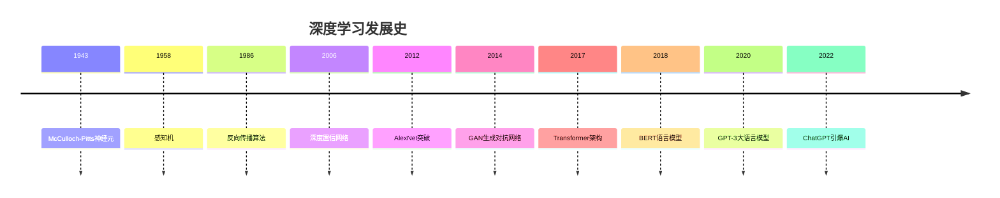

+++
title = '介绍'
weight = 1
+++

开启人工智能新时代的钥匙

- [引言](#引言)
- [什么是深度学习？](#什么是深度学习)
  - [定义与核心概念](#定义与核心概念)
  - [深度学习 vs 传统机器学习](#深度学习-vs-传统机器学习)
- [深度学习的发展历程](#深度学习的发展历程)
  - [历史时间线](#历史时间线)
  - [三次AI浪潮](#三次ai浪潮)
- [神经网络基础](#神经网络基础)
  - [人工神经元](#人工神经元)
  - [激活函数](#激活函数)
- [深度学习的核心技术](#深度学习的核心技术)
  - [1. 反向传播算法](#1-反向传播算法)
  - [2. 梯度下降优化](#2-梯度下降优化)
  - [3. 正则化技术](#3-正则化技术)
- [深度学习架构](#深度学习架构)
  - [1. 卷积神经网络 (CNN)](#1-卷积神经网络-cnn)
  - [2. 循环神经网络 (RNN)](#2-循环神经网络-rnn)
  - [3. Transformer架构](#3-transformer架构)
- [深度学习应用领域](#深度学习应用领域)
  - [1. 计算机视觉](#1-计算机视觉)
  - [2. 自然语言处理](#2-自然语言处理)
  - [3. 语音识别](#3-语音识别)
- [实际项目实践](#实际项目实践)
  - [项目1：手写数字识别](#项目1手写数字识别)
  - [项目2：情感分析系统](#项目2情感分析系统)
- [性能优化与部署](#性能优化与部署)
  - [1. 模型优化技术](#1-模型优化技术)
  - [2. 部署方案](#2-部署方案)
- [深度学习的挑战与解决方案](#深度学习的挑战与解决方案)
  - [1. 常见挑战](#1-常见挑战)
  - [2. 性能监控](#2-性能监控)
- [深度学习的未来趋势](#深度学习的未来趋势)
  - [1. 技术发展方向](#1-技术发展方向)
  - [2. 应用前景](#2-应用前景)
- [学习资源推荐](#学习资源推荐)
  - [1. 在线课程](#1-在线课程)
  - [2. 开发工具](#2-开发工具)
- [总结](#总结)
  - [关键收获](#关键收获)
  - [学习建议](#学习建议)

## 引言

在这个数字化飞速发展的时代，深度学习已经从学术界的前沿理论走向了我们生活的方方面面。从手机上的语音助手到自动驾驶汽车，从医学图像诊断到金融风控，深度学习正在重新定义着技术的边界。本文将带你深入了解这项革命性技术的本质、原理和应用。

## 什么是深度学习？

### 定义与核心概念

深度学习（Deep Learning）是机器学习的一个分支，它模仿人脑神经网络的结构和功能，通过多层神经网络来学习数据的表示。"深度"这个词指的是网络中隐藏层的数量——通常包含多个（通常是数十甚至数百个）隐藏层。

```txt
输入层 → 隐藏层1 → 隐藏层2 → ... → 隐藏层n → 输出层
  ↓        ↓         ↓              ↓        ↓
原始数据   特征1     特征2          特征n    最终结果
```

### 深度学习 vs 传统机器学习

| 特征 | 传统机器学习 | 深度学习 |
|------|-------------|----------|
| **特征提取** | 手工设计特征 | 自动学习特征 |
| **数据需求** | 中小规模数据 | 大规模数据 |
| **计算资源** | 相对较少 | 需要大量GPU |
| **可解释性** | 相对较强 | 黑盒模型 |
| **应用领域** | 传统结构化数据 | 图像、语音、文本等 |

## 深度学习的发展历程

### 历史时间线



### 三次AI浪潮

1. **第一次浪潮 (1950s-1960s)**
   - 符号主义AI
   - 专家系统
   - 逻辑推理

2. **第二次浪潮 (1980s-1990s)**
   - 机器学习
   - 统计方法
   - 支持向量机

3. **第三次浪潮 (2010s-现在)**
   - 深度学习
   - 大数据驱动
   - 端到端学习

## 神经网络基础

### 人工神经元

```python
import numpy as np

class Neuron:
    def __init__(self, num_inputs):
        # 随机初始化权重和偏置
        self.weights = np.random.randn(num_inputs)
        self.bias = np.random.randn()
    
    def forward(self, inputs):
        # 计算加权和
        weighted_sum = np.dot(inputs, self.weights) + self.bias
        # 应用激活函数
        output = self.sigmoid(weighted_sum)
        return output
    
    def sigmoid(self, x):
        return 1 / (1 + np.exp(-x))

# 使用示例
neuron = Neuron(3)  # 3个输入
inputs = np.array([1.0, 2.0, 3.0])
output = neuron.forward(inputs)
print(f"神经元输出: {output}")
```

### 激活函数

激活函数为神经网络引入非线性，使其能够学习复杂的模式：

```python
import matplotlib.pyplot as plt

def activation_functions():
    x = np.linspace(-5, 5, 100)
    
    # 常见激活函数
    sigmoid = 1 / (1 + np.exp(-x))
    tanh = np.tanh(x)
    relu = np.maximum(0, x)
    leaky_relu = np.where(x > 0, x, 0.01 * x)
    
    plt.figure(figsize=(12, 8))
    
    plt.subplot(2, 2, 1)
    plt.plot(x, sigmoid)
    plt.title('Sigmoid')
    plt.grid(True)
    
    plt.subplot(2, 2, 2)
    plt.plot(x, tanh)
    plt.title('Tanh')
    plt.grid(True)
    
    plt.subplot(2, 2, 3)
    plt.plot(x, relu)
    plt.title('ReLU')
    plt.grid(True)
    
    plt.subplot(2, 2, 4)
    plt.plot(x, leaky_relu)
    plt.title('Leaky ReLU')
    plt.grid(True)
    
    plt.tight_layout()
    plt.show()

# 激活函数特点对比
activation_comparison = {
    "Sigmoid": {
        "范围": "(0, 1)",
        "优点": "输出概率解释",
        "缺点": "梯度消失"
    },
    "Tanh": {
        "范围": "(-1, 1)",
        "优点": "零中心化",
        "缺点": "梯度消失"
    },
    "ReLU": {
        "范围": "[0, +∞)",
        "优点": "计算简单，缓解梯度消失",
        "缺点": "神经元死亡"
    },
    "Leaky ReLU": {
        "范围": "(-∞, +∞)",
        "优点": "解决神经元死亡",
        "缺点": "超参数选择"
    }
}
```

## 深度学习的核心技术

### 1. 反向传播算法

反向传播是训练神经网络的核心算法，通过链式法则计算梯度：

```python
class SimpleNeuralNetwork:
    def __init__(self, input_size, hidden_size, output_size):
        # 初始化权重
        self.W1 = np.random.randn(input_size, hidden_size) * 0.01
        self.b1 = np.zeros((1, hidden_size))
        self.W2 = np.random.randn(hidden_size, output_size) * 0.01
        self.b2 = np.zeros((1, output_size))
    
    def forward(self, X):
        # 前向传播
        self.z1 = np.dot(X, self.W1) + self.b1
        self.a1 = np.tanh(self.z1)
        self.z2 = np.dot(self.a1, self.W2) + self.b2
        self.a2 = self.sigmoid(self.z2)
        return self.a2
    
    def backward(self, X, y, output):
        m = X.shape[0]
        
        # 反向传播
        dz2 = output - y
        dW2 = (1/m) * np.dot(self.a1.T, dz2)
        db2 = (1/m) * np.sum(dz2, axis=0, keepdims=True)
        
        dz1 = np.dot(dz2, self.W2.T) * (1 - np.power(self.a1, 2))
        dW1 = (1/m) * np.dot(X.T, dz1)
        db1 = (1/m) * np.sum(dz1, axis=0, keepdims=True)
        
        # 更新参数
        learning_rate = 0.01
        self.W2 -= learning_rate * dW2
        self.b2 -= learning_rate * db2
        self.W1 -= learning_rate * dW1
        self.b1 -= learning_rate * db1
    
    def sigmoid(self, x):
        return 1 / (1 + np.exp(-np.clip(x, -250, 250)))
    
    def train(self, X, y, epochs=1000):
        for i in range(epochs):
            output = self.forward(X)
            self.backward(X, y, output)
            
            if i % 100 == 0:
                loss = np.mean(np.square(output - y))
                print(f"Epoch {i}, Loss: {loss:.4f}")
```

### 2. 梯度下降优化

```python
class Optimizer:
    def __init__(self, learning_rate=0.01):
        self.learning_rate = learning_rate
    
    def sgd(self, params, grads):
        """随机梯度下降"""
        for param, grad in zip(params, grads):
            param -= self.learning_rate * grad
    
    def momentum(self, params, grads, velocities, beta=0.9):
        """动量优化"""
        for i, (param, grad) in enumerate(zip(params, grads)):
            velocities[i] = beta * velocities[i] + (1 - beta) * grad
            param -= self.learning_rate * velocities[i]
    
    def adam(self, params, grads, m, v, t, beta1=0.9, beta2=0.999, epsilon=1e-8):
        """Adam优化器"""
        for i, (param, grad) in enumerate(zip(params, grads)):
            m[i] = beta1 * m[i] + (1 - beta1) * grad
            v[i] = beta2 * v[i] + (1 - beta2) * (grad ** 2)
            
            m_hat = m[i] / (1 - beta1 ** t)
            v_hat = v[i] / (1 - beta2 ** t)
            
            param -= self.learning_rate * m_hat / (np.sqrt(v_hat) + epsilon)
```

### 3. 正则化技术

```python
class RegularizationTechniques:
    def __init__(self):
        pass
    
    def dropout(self, x, dropout_rate=0.5, training=True):
        """Dropout正则化"""
        if not training:
            return x
        
        mask = np.random.binomial(1, 1-dropout_rate, x.shape) / (1-dropout_rate)
        return x * mask
    
    def batch_normalization(self, x, gamma, beta, epsilon=1e-8):
        """批量归一化"""
        mean = np.mean(x, axis=0)
        variance = np.var(x, axis=0)
        x_normalized = (x - mean) / np.sqrt(variance + epsilon)
        return gamma * x_normalized + beta
    
    def l1_regularization(self, weights, lambda_reg=0.01):
        """L1正则化"""
        return lambda_reg * np.sum(np.abs(weights))
    
    def l2_regularization(self, weights, lambda_reg=0.01):
        """L2正则化"""
        return lambda_reg * np.sum(weights ** 2)
```

## 深度学习架构

### 1. 卷积神经网络 (CNN)

CNN特别适用于图像处理任务：

```python
import torch
import torch.nn as nn
import torch.nn.functional as F

class SimpleCNN(nn.Module):
    def __init__(self, num_classes=10):
        super(SimpleCNN, self).__init__()
        
        # 卷积层
        self.conv1 = nn.Conv2d(3, 32, kernel_size=3, padding=1)
        self.conv2 = nn.Conv2d(32, 64, kernel_size=3, padding=1)
        self.conv3 = nn.Conv2d(64, 128, kernel_size=3, padding=1)
        
        # 池化层
        self.pool = nn.MaxPool2d(2, 2)
        
        # 全连接层
        self.fc1 = nn.Linear(128 * 4 * 4, 512)
        self.fc2 = nn.Linear(512, num_classes)
        
        # Dropout
        self.dropout = nn.Dropout(0.5)
    
    def forward(self, x):
        # 卷积 + 激活 + 池化
        x = self.pool(F.relu(self.conv1(x)))  # 32x32 -> 16x16
        x = self.pool(F.relu(self.conv2(x)))  # 16x16 -> 8x8
        x = self.pool(F.relu(self.conv3(x)))  # 8x8 -> 4x4
        
        # 展平
        x = x.view(-1, 128 * 4 * 4)
        
        # 全连接层
        x = F.relu(self.fc1(x))
        x = self.dropout(x)
        x = self.fc2(x)
        
        return x

# 模型使用示例
model = SimpleCNN(num_classes=10)
print(model)

# 计算参数数量
total_params = sum(p.numel() for p in model.parameters())
trainable_params = sum(p.numel() for p in model.parameters() if p.requires_grad)
print(f"总参数: {total_params:,}")
print(f"可训练参数: {trainable_params:,}")
```

### 2. 循环神经网络 (RNN)

RNN适用于序列数据处理：

```python
class SimpleRNN(nn.Module):
    def __init__(self, input_size, hidden_size, output_size, num_layers=1):
        super(SimpleRNN, self).__init__()
        
        self.hidden_size = hidden_size
        self.num_layers = num_layers
        
        # RNN层
        self.rnn = nn.RNN(input_size, hidden_size, num_layers, 
                          batch_first=True, dropout=0.2)
        
        # 输出层
        self.fc = nn.Linear(hidden_size, output_size)
    
    def forward(self, x):
        # 初始化隐藏状态
        h0 = torch.zeros(self.num_layers, x.size(0), self.hidden_size)
        
        # RNN前向传播
        out, hidden = self.rnn(x, h0)
        
        # 取最后一个时间步的输出
        out = self.fc(out[:, -1, :])
        
        return out

class LSTM(nn.Module):
    def __init__(self, input_size, hidden_size, output_size, num_layers=2):
        super(LSTM, self).__init__()
        
        self.hidden_size = hidden_size
        self.num_layers = num_layers
        
        # LSTM层
        self.lstm = nn.LSTM(input_size, hidden_size, num_layers,
                           batch_first=True, dropout=0.3)
        
        # 注意力机制（简化版）
        self.attention = nn.Linear(hidden_size, 1)
        
        # 输出层
        self.fc = nn.Linear(hidden_size, output_size)
    
    def forward(self, x):
        # LSTM
        lstm_out, (hidden, cell) = self.lstm(x)
        
        # 注意力权重
        attention_weights = F.softmax(self.attention(lstm_out), dim=1)
        
        # 加权求和
        context = torch.sum(attention_weights * lstm_out, dim=1)
        
        # 输出
        output = self.fc(context)
        
        return output
```

### 3. Transformer架构

现代深度学习的核心架构：

```python
class MultiHeadAttention(nn.Module):
    def __init__(self, d_model, num_heads):
        super(MultiHeadAttention, self).__init__()
        
        self.d_model = d_model
        self.num_heads = num_heads
        self.d_k = d_model // num_heads
        
        self.W_q = nn.Linear(d_model, d_model)
        self.W_k = nn.Linear(d_model, d_model)
        self.W_v = nn.Linear(d_model, d_model)
        self.W_o = nn.Linear(d_model, d_model)
    
    def scaled_dot_product_attention(self, Q, K, V, mask=None):
        scores = torch.matmul(Q, K.transpose(-2, -1)) / math.sqrt(self.d_k)
        
        if mask is not None:
            scores = scores.masked_fill(mask == 0, -1e9)
        
        attention_weights = F.softmax(scores, dim=-1)
        output = torch.matmul(attention_weights, V)
        
        return output, attention_weights
    
    def forward(self, query, key, value, mask=None):
        batch_size = query.size(0)
        
        # 线性变换并分割成多头
        Q = self.W_q(query).view(batch_size, -1, self.num_heads, self.d_k).transpose(1, 2)
        K = self.W_k(key).view(batch_size, -1, self.num_heads, self.d_k).transpose(1, 2)
        V = self.W_v(value).view(batch_size, -1, self.num_heads, self.d_k).transpose(1, 2)
        
        # 注意力计算
        attention_output, attention_weights = self.scaled_dot_product_attention(Q, K, V, mask)
        
        # 拼接多头
        attention_output = attention_output.transpose(1, 2).contiguous().view(
            batch_size, -1, self.d_model)
        
        # 输出投影
        output = self.W_o(attention_output)
        
        return output

class TransformerBlock(nn.Module):
    def __init__(self, d_model, num_heads, d_ff, dropout=0.1):
        super(TransformerBlock, self).__init__()
        
        self.attention = MultiHeadAttention(d_model, num_heads)
        self.norm1 = nn.LayerNorm(d_model)
        self.norm2 = nn.LayerNorm(d_model)
        
        self.feed_forward = nn.Sequential(
            nn.Linear(d_model, d_ff),
            nn.ReLU(),
            nn.Linear(d_ff, d_model)
        )
        
        self.dropout = nn.Dropout(dropout)
    
    def forward(self, x, mask=None):
        # 多头注意力 + 残差连接
        attention_output = self.attention(x, x, x, mask)
        x = self.norm1(x + self.dropout(attention_output))
        
        # 前馈网络 + 残差连接
        ff_output = self.feed_forward(x)
        x = self.norm2(x + self.dropout(ff_output))
        
        return x
```

## 深度学习应用领域

### 1. 计算机视觉

```python
# 图像分类示例
class ImageClassifier:
    def __init__(self, model_name='resnet50'):
        self.model = torchvision.models.resnet50(pretrained=True)
        self.model.eval()
        
        # 图像预处理
        self.transform = transforms.Compose([
            transforms.Resize(256),
            transforms.CenterCrop(224),
            transforms.ToTensor(),
            transforms.Normalize(mean=[0.485, 0.456, 0.406],
                               std=[0.229, 0.224, 0.225])
        ])
    
    def predict(self, image_path):
        image = Image.open(image_path)
        input_tensor = self.transform(image).unsqueeze(0)
        
        with torch.no_grad():
            outputs = self.model(input_tensor)
            probabilities = F.softmax(outputs[0], dim=0)
            
        return probabilities

# 目标检测
class ObjectDetector:
    def __init__(self):
        self.model = torchvision.models.detection.fasterrcnn_resnet50_fpn(pretrained=True)
        self.model.eval()
    
    def detect(self, image):
        transform = transforms.Compose([transforms.ToTensor()])
        input_tensor = transform(image).unsqueeze(0)
        
        with torch.no_grad():
            predictions = self.model(input_tensor)
        
        return predictions[0]
```

### 2. 自然语言处理

```python
# 文本分类
class TextClassifier(nn.Module):
    def __init__(self, vocab_size, embedding_dim, hidden_dim, output_dim):
        super(TextClassifier, self).__init__()
        
        self.embedding = nn.Embedding(vocab_size, embedding_dim)
        self.lstm = nn.LSTM(embedding_dim, hidden_dim, batch_first=True)
        self.fc = nn.Linear(hidden_dim, output_dim)
        self.dropout = nn.Dropout(0.5)
    
    def forward(self, x):
        embedded = self.embedding(x)
        lstm_out, (hidden, _) = self.lstm(embedded)
        
        # 使用最后一个隐藏状态
        output = self.fc(self.dropout(hidden[-1]))
        
        return output

# 使用预训练模型
from transformers import AutoTokenizer, AutoModelForSequenceClassification

class BERTClassifier:
    def __init__(self, model_name='bert-base-uncased'):
        self.tokenizer = AutoTokenizer.from_pretrained(model_name)
        self.model = AutoModelForSequenceClassification.from_pretrained(model_name)
    
    def predict(self, text):
        inputs = self.tokenizer(text, return_tensors="pt", 
                              truncation=True, padding=True)
        
        with torch.no_grad():
            outputs = self.model(**inputs)
            predictions = F.softmax(outputs.logits, dim=-1)
        
        return predictions
```

### 3. 语音识别

```python
# 简化的语音识别模型
class SpeechRecognitionModel(nn.Module):
    def __init__(self, input_dim, hidden_dim, vocab_size):
        super(SpeechRecognitionModel, self).__init__()
        
        # 声学模型
        self.acoustic_model = nn.Sequential(
            nn.Linear(input_dim, hidden_dim),
            nn.ReLU(),
            nn.Dropout(0.2),
            nn.Linear(hidden_dim, hidden_dim),
            nn.ReLU(),
            nn.Dropout(0.2)
        )
        
        # 序列建模
        self.lstm = nn.LSTM(hidden_dim, hidden_dim, 
                           num_layers=2, bidirectional=True)
        
        # 输出层
        self.output_layer = nn.Linear(hidden_dim * 2, vocab_size)
    
    def forward(self, x):
        # 声学特征提取
        acoustic_features = self.acoustic_model(x)
        
        # 序列建模
        lstm_out, _ = self.lstm(acoustic_features)
        
        # 输出概率
        output = self.output_layer(lstm_out)
        
        return F.log_softmax(output, dim=-1)
```

## 实际项目实践

### 项目1：手写数字识别

```python
import torch
import torch.nn as nn
import torch.optim as optim
from torchvision import datasets, transforms
from torch.utils.data import DataLoader

# 数据准备
transform = transforms.Compose([
    transforms.ToTensor(),
    transforms.Normalize((0.1307,), (0.3081,))
])

train_dataset = datasets.MNIST('data', train=True, download=True, transform=transform)
test_dataset = datasets.MNIST('data', train=False, transform=transform)

train_loader = DataLoader(train_dataset, batch_size=64, shuffle=True)
test_loader = DataLoader(test_dataset, batch_size=1000, shuffle=False)

# 模型定义
class MNISTNet(nn.Module):
    def __init__(self):
        super(MNISTNet, self).__init__()
        self.conv1 = nn.Conv2d(1, 32, 3, 1)
        self.conv2 = nn.Conv2d(32, 64, 3, 1)
        self.dropout1 = nn.Dropout(0.25)
        self.dropout2 = nn.Dropout(0.5)
        self.fc1 = nn.Linear(9216, 128)
        self.fc2 = nn.Linear(128, 10)

    def forward(self, x):
        x = self.conv1(x)
        x = F.relu(x)
        x = self.conv2(x)
        x = F.relu(x)
        x = F.max_pool2d(x, 2)
        x = self.dropout1(x)
        x = torch.flatten(x, 1)
        x = self.fc1(x)
        x = F.relu(x)
        x = self.dropout2(x)
        x = self.fc2(x)
        return F.log_softmax(x, dim=1)

# 训练函数
def train(model, device, train_loader, optimizer, epoch):
    model.train()
    for batch_idx, (data, target) in enumerate(train_loader):
        data, target = data.to(device), target.to(device)
        optimizer.zero_grad()
        output = model(data)
        loss = F.nll_loss(output, target)
        loss.backward()
        optimizer.step()
        
        if batch_idx % 100 == 0:
            print(f'Train Epoch: {epoch} [{batch_idx * len(data)}/{len(train_loader.dataset)}]'
                  f' Loss: {loss.item():.6f}')

# 测试函数
def test(model, device, test_loader):
    model.eval()
    test_loss = 0
    correct = 0
    with torch.no_grad():
        for data, target in test_loader:
            data, target = data.to(device), target.to(device)
            output = model(data)
            test_loss += F.nll_loss(output, target, reduction='sum').item()
            pred = output.argmax(dim=1, keepdim=True)
            correct += pred.eq(target.view_as(pred)).sum().item()

    test_loss /= len(test_loader.dataset)
    accuracy = 100. * correct / len(test_loader.dataset)
    
    print(f'Test set: Average loss: {test_loss:.4f}, '
          f'Accuracy: {correct}/{len(test_loader.dataset)} ({accuracy:.2f}%)')

# 主训练循环
device = torch.device("cuda" if torch.cuda.is_available() else "cpu")
model = MNISTNet().to(device)
optimizer = optim.Adam(model.parameters(), lr=0.001)

for epoch in range(1, 6):
    train(model, device, train_loader, optimizer, epoch)
    test(model, device, test_loader)

# 保存模型
torch.save(model.state_dict(), "mnist_model.pth")
```

### 项目2：情感分析系统

```python
import pandas as pd
from sklearn.model_selection import train_test_split
from transformers import AutoTokenizer, AutoModelForSequenceClassification, Trainer, TrainingArguments

class SentimentAnalyzer:
    def __init__(self, model_name='distilbert-base-uncased'):
        self.tokenizer = AutoTokenizer.from_pretrained(model_name)
        self.model = AutoModelForSequenceClassification.from_pretrained(
            model_name, num_labels=2
        )
    
    def preprocess_data(self, texts, labels=None):
        encodings = self.tokenizer(
            texts, 
            truncation=True, 
            padding=True, 
            max_length=512,
            return_tensors='pt'
        )
        
        if labels is not None:
            encodings['labels'] = torch.tensor(labels)
        
        return encodings
    
    def train(self, train_texts, train_labels, val_texts, val_labels):
        train_encodings = self.preprocess_data(train_texts, train_labels)
        val_encodings = self.preprocess_data(val_texts, val_labels)
        
        training_args = TrainingArguments(
            output_dir='./sentiment_model',
            num_train_epochs=3,
            per_device_train_batch_size=16,
            per_device_eval_batch_size=64,
            warmup_steps=500,
            weight_decay=0.01,
            logging_dir='./logs',
            evaluation_strategy="epoch",
            save_strategy="epoch",
            load_best_model_at_end=True,
        )
        
        trainer = Trainer(
            model=self.model,
            args=training_args,
            train_dataset=train_encodings,
            eval_dataset=val_encodings,
        )
        
        trainer.train()
    
    def predict(self, text):
        inputs = self.tokenizer(text, return_tensors="pt", 
                              truncation=True, padding=True)
        
        with torch.no_grad():
            outputs = self.model(**inputs)
            predictions = F.softmax(outputs.logits, dim=-1)
            
        sentiment = "positive" if predictions[0][1] > 0.5 else "negative"
        confidence = float(max(predictions[0]))
        
        return {
            "sentiment": sentiment,
            "confidence": confidence,
            "probabilities": {
                "negative": float(predictions[0][0]),
                "positive": float(predictions[0][1])
            }
        }

# 使用示例
analyzer = SentimentAnalyzer()

# 预测示例
result = analyzer.predict("I love this movie! It's amazing!")
print(f"情感: {result['sentiment']}")
print(f"置信度: {result['confidence']:.2f}")
```

## 性能优化与部署

### 1. 模型优化技术

```python
# 模型量化
def quantize_model(model):
    # 动态量化
    quantized_model = torch.quantization.quantize_dynamic(
        model, {nn.Linear}, dtype=torch.qint8
    )
    return quantized_model

# 模型剪枝
import torch.nn.utils.prune as prune

def prune_model(model, pruning_ratio=0.2):
    for module in model.modules():
        if isinstance(module, nn.Linear):
            prune.l1_unstructured(module, name='weight', amount=pruning_ratio)
            prune.remove(module, 'weight')
    return model

# 知识蒸馏
class DistillationLoss(nn.Module):
    def __init__(self, temperature=4.0, alpha=0.7):
        super(DistillationLoss, self).__init__()
        self.temperature = temperature
        self.alpha = alpha
        self.kl_div = nn.KLDivLoss(reduction='batchmean')
    
    def forward(self, student_logits, teacher_logits, labels):
        # 蒸馏损失
        soft_targets = F.softmax(teacher_logits / self.temperature, dim=1)
        soft_predictions = F.log_softmax(student_logits / self.temperature, dim=1)
        distillation_loss = self.kl_div(soft_predictions, soft_targets) * (self.temperature ** 2)
        
        # 标准交叉熵损失
        student_loss = F.cross_entropy(student_logits, labels)
        
        # 组合损失
        total_loss = self.alpha * distillation_loss + (1 - self.alpha) * student_loss
        
        return total_loss
```

### 2. 部署方案

```python
# Flask API部署
from flask import Flask, request, jsonify
import torch
import torchvision.transforms as transforms
from PIL import Image
import io

app = Flask(__name__)

# 加载模型
model = torch.load('model.pth', map_location='cpu')
model.eval()

# 图像预处理
transform = transforms.Compose([
    transforms.Resize((224, 224)),
    transforms.ToTensor(),
    transforms.Normalize(mean=[0.485, 0.456, 0.406],
                        std=[0.229, 0.224, 0.225])
])

@app.route('/predict', methods=['POST'])
def predict():
    try:
        # 获取图像
        image_file = request.files['image']
        image = Image.open(io.BytesIO(image_file.read())).convert('RGB')
        
        # 预处理
        input_tensor = transform(image).unsqueeze(0)
        
        # 预测
        with torch.no_grad():
            outputs = model(input_tensor)
            probabilities = F.softmax(outputs, dim=1)
            predicted_class = torch.argmax(probabilities, dim=1).item()
            confidence = probabilities[0][predicted_class].item()
        
        return jsonify({
            'predicted_class': predicted_class,
            'confidence': confidence,
            'status': 'success'
        })
    
    except Exception as e:
        return jsonify({
            'error': str(e),
            'status': 'error'
        })

if __name__ == '__main__':
    app.run(host='0.0.0.0', port=5000)

# Docker部署配置
dockerfile_content = """
FROM python:3.9-slim

WORKDIR /app

COPY requirements.txt .
RUN pip install -r requirements.txt

COPY . .

EXPOSE 5000

CMD ["python", "app.py"]
"""

# requirements.txt
requirements = """
torch==1.9.0
torchvision==0.10.0
flask==2.0.1
Pillow==8.3.2
numpy==1.21.0
"""
```

## 深度学习的挑战与解决方案

### 1. 常见挑战

```python
# 过拟合问题
class OverfittingSolutions:
    @staticmethod
    def early_stopping(model, val_loader, patience=10):
        best_val_loss = float('inf')
        patience_counter = 0
        
        for epoch in range(epochs):
            # 训练...
            val_loss = validate(model, val_loader)
            
            if val_loss < best_val_loss:
                best_val_loss = val_loss
                patience_counter = 0
                # 保存最佳模型
                torch.save(model.state_dict(), 'best_model.pth')
            else:
                patience_counter += 1
                
            if patience_counter >= patience:
                print("Early stopping triggered")
                break
    
    @staticmethod
    def data_augmentation():
        return transforms.Compose([
            transforms.RandomRotation(10),
            transforms.RandomHorizontalFlip(),
            transforms.RandomResizedCrop(224),
            transforms.ColorJitter(brightness=0.2, contrast=0.2),
            transforms.ToTensor(),
            transforms.Normalize(mean=[0.485, 0.456, 0.406],
                               std=[0.229, 0.224, 0.225])
        ])

# 梯度消失/爆炸
class GradientSolutions:
    @staticmethod
    def gradient_clipping(model, max_norm=1.0):
        torch.nn.utils.clip_grad_norm_(model.parameters(), max_norm)
    
    @staticmethod
    def residual_connection(x, layer):
        return x + layer(x)  # 残差连接
    
    @staticmethod
    def batch_normalization(x):
        return F.batch_norm(x, running_mean=None, running_var=None, training=True)
```

### 2. 性能监控

```python
import wandb
import matplotlib.pyplot as plt

class TrainingMonitor:
    def __init__(self, project_name="deep-learning-project"):
        wandb.init(project=project_name)
        self.metrics = {
            'train_loss': [],
            'val_loss': [],
            'train_acc': [],
            'val_acc': []
        }
    
    def log_metrics(self, epoch, train_loss, val_loss, train_acc, val_acc):
        # 记录指标
        self.metrics['train_loss'].append(train_loss)
        self.metrics['val_loss'].append(val_loss)
        self.metrics['train_acc'].append(train_acc)
        self.metrics['val_acc'].append(val_acc)
        
        # 上传到wandb
        wandb.log({
            'epoch': epoch,
            'train_loss': train_loss,
            'val_loss': val_loss,
            'train_accuracy': train_acc,
            'val_accuracy': val_acc
        })
    
    def plot_training_curves(self):
        fig, (ax1, ax2) = plt.subplots(1, 2, figsize=(12, 5))
        
        # 损失曲线
        ax1.plot(self.metrics['train_loss'], label='Train Loss')
        ax1.plot(self.metrics['val_loss'], label='Val Loss')
        ax1.set_xlabel('Epoch')
        ax1.set_ylabel('Loss')
        ax1.legend()
        ax1.set_title('Training and Validation Loss')
        
        # 准确率曲线
        ax2.plot(self.metrics['train_acc'], label='Train Accuracy')
        ax2.plot(self.metrics['val_acc'], label='Val Accuracy')
        ax2.set_xlabel('Epoch')
        ax2.set_ylabel('Accuracy')
        ax2.legend()
        ax2.set_title('Training and Validation Accuracy')
        
        plt.tight_layout()
        plt.show()
        
        # 上传图表到wandb
        wandb.log({"training_curves": fig})
```

## 深度学习的未来趋势

### 1. 技术发展方向

```markdown
## 前沿技术趋势

### 架构创新
- **Vision Transformer (ViT)**: 将Transformer应用到计算机视觉
- **混合专家模型 (MoE)**: 提高模型容量而不增加计算成本
- **神经架构搜索 (NAS)**: 自动设计最优网络架构

### 训练效率
- **自监督学习**: 减少对标注数据的依赖
- **少样本学习**: 快速适应新任务
- **持续学习**: 避免灾难性遗忘

### 可解释性
- **注意力可视化**: 理解模型关注点
- **LIME/SHAP**: 局部模型解释
- **概念激活向量**: 高层概念理解
```

### 2. 应用前景

```python
# 多模态学习示例
class MultiModalModel(nn.Module):
    def __init__(self, text_dim, image_dim, hidden_dim, output_dim):
        super(MultiModalModel, self).__init__()
        
        # 文本编码器
        self.text_encoder = nn.Sequential(
            nn.Linear(text_dim, hidden_dim),
            nn.ReLU(),
            nn.Dropout(0.2)
        )
        
        # 图像编码器
        self.image_encoder = nn.Sequential(
            nn.Linear(image_dim, hidden_dim),
            nn.ReLU(),
            nn.Dropout(0.2)
        )
        
        # 融合层
        self.fusion = nn.Sequential(
            nn.Linear(hidden_dim * 2, hidden_dim),
            nn.ReLU(),
            nn.Dropout(0.3),
            nn.Linear(hidden_dim, output_dim)
        )
    
    def forward(self, text_features, image_features):
        text_encoded = self.text_encoder(text_features)
        image_encoded = self.image_encoder(image_features)
        
        # 特征融合
        fused_features = torch.cat([text_encoded, image_encoded], dim=1)
        output = self.fusion(fused_features)
        
        return output

# 自适应学习率调度
class AdaptiveLRScheduler:
    def __init__(self, optimizer, patience=10, factor=0.5, min_lr=1e-6):
        self.optimizer = optimizer
        self.patience = patience
        self.factor = factor
        self.min_lr = min_lr
        self.best_metric = None
        self.patience_counter = 0
    
    def step(self, metric):
        if self.best_metric is None or metric > self.best_metric:
            self.best_metric = metric
            self.patience_counter = 0
        else:
            self.patience_counter += 1
            
        if self.patience_counter >= self.patience:
            self.reduce_lr()
            self.patience_counter = 0
    
    def reduce_lr(self):
        for param_group in self.optimizer.param_groups:
            old_lr = param_group['lr']
            new_lr = max(old_lr * self.factor, self.min_lr)
            param_group['lr'] = new_lr
            print(f"Learning rate reduced: {old_lr:.6f} -> {new_lr:.6f}")
```

## 学习资源推荐

### 1. 在线课程

```markdown
## 推荐课程

### 入门级
- **Andrew Ng 深度学习专项课程** (Coursera)
- **MIT 6.034 人工智能** (OCW)
- **Stanford CS229 机器学习**

### 进阶级
- **Stanford CS231n 卷积神经网络**
- **Stanford CS224n 自然语言处理**
- **Berkeley CS294 深度强化学习**

### 实践项目
- **Kaggle 竞赛**
- **GitHub 开源项目**
- **Papers With Code**
```

### 2. 开发工具

```python
# 推荐的深度学习工具栈
tools_ecosystem = {
    "深度学习框架": {
        "PyTorch": "研究友好，动态图",
        "TensorFlow": "生产部署，静态图",
        "JAX": "函数式编程，高性能",
        "Flax": "基于JAX的神经网络库"
    },
    
    "数据处理": {
        "pandas": "结构化数据处理",
        "numpy": "数值计算",
        "scikit-learn": "传统机器学习",
        "OpenCV": "计算机视觉"
    },
    
    "可视化": {
        "matplotlib": "基础绘图",
        "seaborn": "统计可视化",
        "plotly": "交互式图表",
        "wandb": "实验跟踪"
    },
    
    "部署": {
        "FastAPI": "高性能API",
        "Docker": "容器化部署",
        "Kubernetes": "容器编排",
        "TensorRT": "推理优化"
    }
}
```

## 总结

深度学习作为人工智能的核心技术，正在以前所未有的速度改变着我们的世界。从基础的神经网络到复杂的Transformer架构，从图像识别到自然语言处理，深度学习技术的应用领域越来越广泛。

### 关键收获

1. **理论基础**: 掌握神经网络、反向传播等核心概念
2. **实践技能**: 熟悉主流框架和开发流程
3. **应用思维**: 能够将技术应用到实际问题中
4. **优化方法**: 了解性能优化和部署策略

### 学习建议

- **理论与实践并重**: 既要理解原理，也要动手实现
- **循序渐进**: 从简单项目开始，逐步增加复杂度
- **关注前沿**: 跟上最新技术发展趋势
- **多领域应用**: 尝试在不同领域应用深度学习

深度学习的旅程充满挑战但也充满机遇。随着技术的不断发展，我们有理由相信，深度学习将继续推动人工智能的进步，为人类社会带来更多价值。

---

**作者**: meimeitou  
**标签**: #深度学习 #人工智能 #神经网络 #机器学习
