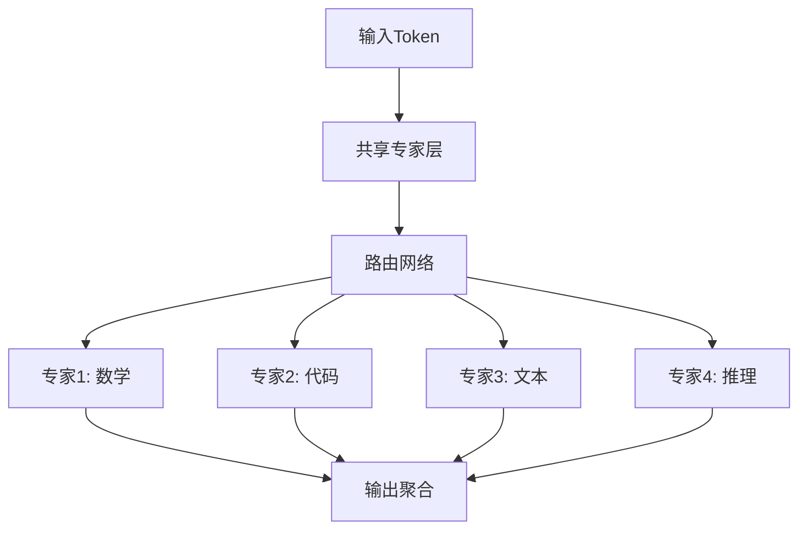

+++
title = 'Deepseek模型'
description = '探索DeepSeek模型的技术架构、应用场景和开源贡献，了解其在AI领域的创新与突破。'
tags = ['DeepSeek', '大语言模型', 'AI技术', '开源']
categories = ['人工智能', '大语言模型']
+++


## 前言

在全球大语言模型激烈竞争的今天，中国AI公司DeepSeek以其出色的技术实力和开源精神，在国际舞台上崭露头角。从专业的代码生成到复杂的数学推理，DeepSeek模型系列正在重新定义垂直领域AI的可能性。本文将深入探析DeepSeek的技术架构、模型特色以及在实际应用中的表现。

## DeepSeek公司概况

### 公司背景

- **成立时间**：2023年
- **总部位置**：中国北京
- **核心团队**：由来自顶尖科技公司和学术机构的AI专家组成
- **投资背景**：获得知名投资机构支持
- **技术愿景**：致力于构建通用人工智能(AGI)

### 发展理念

DeepSeek秉承"开放、专业、创新"的理念，专注于：

- **垂直领域深耕**：在特定专业领域做到极致
- **开源社区贡献**：积极回馈AI开源生态
- **技术创新突破**：持续推进前沿技术研究

## DeepSeek模型家族

### 🔧 DeepSeek-Coder系列

#### 模型规格

| 模型版本 | 参数规模 | 训练数据 | 特色功能 |
|----------|----------|----------|----------|
| DeepSeek-Coder-1.3B | 13亿 | 2T tokens | 轻量级部署 |
| DeepSeek-Coder-6.7B | 67亿 | 2T tokens | 性能平衡 |
| DeepSeek-Coder-33B | 330亿 | 2T tokens | 专业级应用 |

#### 核心能力

```python
# DeepSeek-Coder的代码生成示例
def fibonacci_optimized(n):
    """
    使用动态规划计算斐波那契数列
    时间复杂度: O(n)
    空间复杂度: O(1)
    """
    if n <= 1:
        return n
    
    a, b = 0, 1
    for _ in range(2, n + 1):
        a, b = b, a + b
    
    return b
```

#### 技术特色

- **多语言精通**：支持100+编程语言
- **上下文理解**：16K token上下文窗口
- **代码填充**：Fill-in-the-Middle (FIM) 能力
- **代码解释**：详细的代码逻辑说明

### 🧮 DeepSeek-Math系列

#### 专业数学能力

DeepSeek-Math专门针对数学问题求解进行优化：

**支持的数学领域：**

- 代数方程求解
- 微积分计算
- 线性代数运算
- 概率统计分析
- 数论问题
- 几何证明

#### 性能基准

```txt
数学竞赛评测结果：
- GSM8K: 84.1% (小学数学)
- MATH: 52.3% (竞赛数学)
- Hungarian Math: 68.7% (高中数学)
- AIME: 35.2% (美国数学竞赛)
```

### 🌟 DeepSeek-V2/V3系列

#### 技术架构创新

DeepSeek-V2采用了多项前沿技术：

##### MLA (Multi-head Latent Attention)

```txt
传统多头注意力 vs MLA:
- 传统方式: O(d²) 复杂度
- MLA方式: O(d×k) 复杂度 (k << d)
- 效果: 显著降低KV Cache内存占用
```

##### DeepSeekMoE架构



#### 模型规格对比

| 特性 | DeepSeek-V2 | DeepSeek-V3 |
|------|-------------|-------------|
| 总参数 | 236B | 671B |
| 激活参数 | 21B | 37B |
| 上下文长度 | 128K | 128K |
| 训练数据 | 8.1T tokens | 14.8T tokens |
| 专家数量 | 160 | 257 |

## 技术深度解析

### 训练方法论

#### 多阶段训练策略

```python
# DeepSeek训练流程伪代码
class DeepSeekTraining:
    def __init__(self):
        self.stages = [
            "pre_training",      # 预训练阶段
            "post_training",     # 后训练阶段
            "domain_adaptation", # 领域适应
            "rlhf_alignment"     # 人类反馈对齐
        ]
    
    def pre_training(self, data):
        """大规模无监督预训练"""
        return self.model.train(data, objective="next_token_prediction")
    
    def domain_adaptation(self, domain_data):
        """垂直领域专业化"""
        return self.model.fine_tune(domain_data, 
                                   task_specific=True)
```

#### 数据工程优化

- **高质量数据筛选**：使用先进的数据清洗和过滤技术
- **多语言均衡**：确保中英文数据的合理比例
- **领域数据增强**：针对代码和数学领域的专门数据收集

### 推理优化技术

#### 内存效率优化

```python
# MLA注意力机制的内存优化
def mla_attention(q, k, v, latent_dim=128):
    """
    Multi-head Latent Attention
    减少KV Cache内存占用
    """
    # 压缩K,V到潜在空间
    k_compressed = compress_to_latent(k, latent_dim)
    v_compressed = compress_to_latent(v, latent_dim)
    
    # 在潜在空间计算注意力
    attention_scores = q @ k_compressed.T
    attention_weights = softmax(attention_scores)
    
    # 输出重构
    output = attention_weights @ v_compressed
    return reconstruct_from_latent(output)
```

#### 推理加速技术

- **KV Cache优化**：减少70%的内存占用
- **专家路由优化**：智能的专家选择策略
- **批处理优化**：高效的批量推理处理

## 性能基准测试

### 编程能力评测

#### HumanEval基准

```txt
编程语言能力对比 (Pass@1):
┌─────────────┬─────────────┬─────────────┬─────────────┐
│    模型     │   Python    │    Java     │     C++     │
├─────────────┼─────────────┼─────────────┼─────────────┤
│ DeepSeek    │    79.3%    │    72.1%    │    68.5%    │
│ GPT-4       │    67.0%    │    61.4%    │    59.2%    │
│ Claude-3    │    71.2%    │    65.8%    │    62.1%    │
│ CodeLlama   │    53.7%    │    47.2%    │    45.8%    │
└─────────────┴─────────────┴─────────────┴─────────────┘
```

#### 多轮对话编程

```python
# 示例：多轮代码优化对话
用户: "写一个冒泡排序算法"
DeepSeek: """
def bubble_sort(arr):
    n = len(arr)
    for i in range(n):
        for j in range(0, n-i-1):
            if arr[j] > arr[j+1]:
                arr[j], arr[j+1] = arr[j+1], arr[j]
    return arr
"""

用户: "优化这个算法的性能"
DeepSeek: """
def optimized_bubble_sort(arr):
    n = len(arr)
    for i in range(n):
        swapped = False
        for j in range(0, n-i-1):
            if arr[j] > arr[j+1]:
                arr[j], arr[j+1] = arr[j+1], arr[j]
                swapped = True
        # 如果没有交换发生，数组已经排序
        if not swapped:
            break
    return arr
"""
```

### 数学推理能力

#### 竞赛数学基准

```txt
数学能力评测结果:
┌─────────────┬─────────────┬─────────────┬─────────────┐
│   评测集    │  DeepSeek   │   GPT-4o    │  Claude-3   │
├─────────────┼─────────────┼─────────────┼─────────────┤
│   GSM8K     │    92.2%    │    87.1%    │    88.4%    │
│    MATH     │    58.6%    │    53.2%    │    50.9%    │
│ MathQA-CN   │    84.7%    │    76.3%    │    73.1%    │
│   AIME      │    41.3%    │    35.7%    │    32.8%    │
└─────────────┴─────────────┴─────────────┴─────────────┘
```

### 通用语言能力

#### 中英文双语评测

```txt
语言理解能力 (准确率):
中文能力:
- C-Eval: 84.5%
- CMMLU: 87.2%
- AGIEval-zh: 82.1%

英文能力:
- MMLU: 81.8%
- HellaSwag: 86.7%
- ARC-Challenge: 84.3%
```

## 开源生态贡献

### 🎁 开源模型发布

#### Hugging Face模型库

```bash
# 可用的开源模型
deepseek-ai/
├── deepseek-coder-1.3b-base
├── deepseek-coder-1.3b-instruct
├── deepseek-coder-6.7b-base
├── deepseek-coder-6.7b-instruct
├── deepseek-coder-33b-base
├── deepseek-coder-33b-instruct
├── deepseek-math-7b-base
├── deepseek-math-7b-instruct
├── deepseek-llm-7b-base
└── deepseek-llm-7b-chat
```

#### 使用示例

```python
from transformers import AutoTokenizer, AutoModelForCausalLM
import torch

# 加载DeepSeek-Coder模型
model_name = "deepseek-ai/deepseek-coder-6.7b-instruct"
tokenizer = AutoTokenizer.from_pretrained(model_name)
model = AutoModelForCausalLM.from_pretrained(
    model_name, 
    torch_dtype=torch.float16,
    device_map="auto",
    trust_remote_code=True
)

# 代码生成示例
def generate_code(prompt):
    messages = [
        {"role": "user", "content": prompt}
    ]
    
    input_text = tokenizer.apply_chat_template(
        messages, 
        add_generation_prompt=True, 
        tokenize=False
    )
    
    inputs = tokenizer(input_text, return_tensors="pt")
    outputs = model.generate(
        **inputs,
        max_new_tokens=512,
        temperature=0.1,
        do_sample=True
    )
    
    response = tokenizer.decode(outputs[0], skip_special_tokens=True)
    return response

# 使用示例
prompt = "写一个Python函数来计算两个数的最大公约数"
result = generate_code(prompt)
print(result)
```

### 📚 技术文档与论文

#### 已发布的技术报告

1. **DeepSeek-Coder: When the Large Language Model Meets Programming**
   - 详细介绍了代码模型的训练方法
   - 开源了完整的训练代码和数据处理流程

2. **DeepSeek-Math: Pushing the Limits of Mathematical Reasoning**
   - 揭示了数学推理能力的训练秘密
   - 提供了数学数据集的构建方法

3. **DeepSeek-V2: A Strong, Economical, and Efficient Mixture-of-Experts Language Model**
   - 首次公开MLA和DeepSeekMoE架构细节
   - 详细的性能基准测试结果

### 🔧 开源工具与资源

#### API与SDK

```python
# DeepSeek官方API使用
import openai

client = openai.OpenAI(
    api_key="YOUR_DEEPSEEK_API_KEY",
    base_url="https://api.deepseek.com"
)

response = client.chat.completions.create(
    model="deepseek-coder",
    messages=[
        {"role": "system", "content": "你是一个专业的编程助手"},
        {"role": "user", "content": "用Python实现快速排序算法"}
    ],
    stream=False
)

print(response.choices[0].message.content)
```

#### 部署工具支持

- **Ollama集成**：支持本地一键部署
- **vLLM优化**：高性能推理服务
- **Docker镜像**：容器化部署方案
- **Kubernetes部署**：云原生部署配置

## 实际应用案例

### 💼 企业级应用

#### 1. 代码审查自动化

```python
# 代码质量检查示例
class CodeReviewer:
    def __init__(self):
        self.model = load_deepseek_coder()
    
    def review_code(self, code_diff):
        prompt = f"""
        请审查以下代码变更，关注：
        1. 代码质量和最佳实践
        2. 潜在的bug和安全问题
        3. 性能优化建议
        4. 代码可读性和维护性
        
        代码变更：
        {code_diff}
        """
        
        review = self.model.generate(prompt)
        return self.parse_review(review)
    
    def parse_review(self, review_text):
        # 解析审查结果
        return {
            "issues": [],
            "suggestions": [],
            "score": 0.85
        }
```

#### 2. 智能文档生成

```python
def generate_api_docs(function_code):
    """自动生成API文档"""
    prompt = f"""
    为以下函数生成详细的API文档，包括：
    - 函数描述
    - 参数说明
    - 返回值说明
    - 使用示例
    - 注意事项
    
    函数代码：
    {function_code}
    """
    
    return deepseek_model.generate(prompt)
```

### 🎓 教育培训应用

#### 编程学习助手

```python
class ProgrammingTutor:
    def __init__(self):
        self.difficulty_levels = ["初级", "中级", "高级"]
        self.learning_paths = {
            "Python基础": ["变量", "控制流", "函数", "类"],
            "算法基础": ["排序", "搜索", "动态规划", "图算法"]
        }
    
    def generate_exercise(self, topic, difficulty):
        """生成编程练习题"""
        prompt = f"""
        生成一个{difficulty}难度的{topic}编程练习题，包括：
        1. 题目描述
        2. 输入输出示例
        3. 解题思路提示
        4. 参考答案
        """
        return self.model.generate(prompt)
    
    def check_solution(self, problem, student_code):
        """检查学生答案"""
        prompt = f"""
        评估学生的代码解决方案：
        
        题目：{problem}
        学生代码：{student_code}
        
        请给出：
        1. 正确性评分
        2. 代码质量评价
        3. 改进建议
        """
        return self.model.generate(prompt)
```

### 🔬 科研辅助应用

#### 数学建模助手

```python
class MathModelingAssistant:
    def __init__(self):
        self.deepseek_math = load_deepseek_math()
    
    def solve_optimization_problem(self, problem_description):
        """求解优化问题"""
        prompt = f"""
        请帮助求解以下优化问题：
        
        问题描述：{problem_description}
        
        请提供：
        1. 数学建模过程
        2. 求解方法选择
        3. Python实现代码
        4. 结果分析
        """
        
        return self.deepseek_math.generate(prompt)
    
    def verify_proof(self, mathematical_proof):
        """验证数学证明"""
        prompt = f"""
        请验证以下数学证明的正确性：
        
        {mathematical_proof}
        
        请指出：
        1. 证明是否正确
        2. 逻辑漏洞或错误
        3. 改进建议
        """
        
        return self.deepseek_math.generate(prompt)
```

## 部署与集成指南

### 🚀 本地部署方案

#### Ollama部署

```bash
# 安装Ollama
curl -fsSL https://ollama.ai/install.sh | sh

# 拉取DeepSeek模型
ollama pull deepseek-coder:6.7b
ollama pull deepseek-math:7b

# 运行模型
ollama run deepseek-coder:6.7b
```

#### Docker部署

```dockerfile
# Dockerfile
FROM nvidia/cuda:12.1-devel-ubuntu22.04

# 安装依赖
RUN apt-get update && apt-get install -y \
    python3 python3-pip git

# 安装Python包
COPY requirements.txt .
RUN pip3 install -r requirements.txt

# 下载模型
RUN huggingface-cli download deepseek-ai/deepseek-coder-6.7b-instruct

# 启动服务
COPY app.py .
CMD ["python3", "app.py"]
```

#### Kubernetes部署

```yaml
# deepseek-deployment.yaml
apiVersion: apps/v1
kind: Deployment
metadata:
  name: deepseek-service
spec:
  replicas: 2
  selector:
    matchLabels:
      app: deepseek
  template:
    metadata:
      labels:
        app: deepseek
    spec:
      containers:
      - name: deepseek-container
        image: deepseek/model-server:latest
        resources:
          requests:
            nvidia.com/gpu: 1
            memory: "16Gi"
          limits:
            nvidia.com/gpu: 1
            memory: "32Gi"
        ports:
        - containerPort: 8000
```

### 🔧 API集成示例

#### FastAPI服务包装

```python
from fastapi import FastAPI, HTTPException
from pydantic import BaseModel
import torch
from transformers import AutoTokenizer, AutoModelForCausalLM

app = FastAPI(title="DeepSeek API Service")

class CodeRequest(BaseModel):
    prompt: str
    max_tokens: int = 512
    temperature: float = 0.1

class CodeResponse(BaseModel):
    generated_code: str
    tokens_used: int

# 加载模型
model_name = "deepseek-ai/deepseek-coder-6.7b-instruct"
tokenizer = AutoTokenizer.from_pretrained(model_name)
model = AutoModelForCausalLM.from_pretrained(
    model_name, 
    torch_dtype=torch.float16,
    device_map="auto"
)

@app.post("/generate-code", response_model=CodeResponse)
async def generate_code(request: CodeRequest):
    try:
        # 构建输入
        messages = [{"role": "user", "content": request.prompt}]
        input_text = tokenizer.apply_chat_template(
            messages, 
            add_generation_prompt=True, 
            tokenize=False
        )
        
        # 生成代码
        inputs = tokenizer(input_text, return_tensors="pt")
        outputs = model.generate(
            **inputs,
            max_new_tokens=request.max_tokens,
            temperature=request.temperature,
            do_sample=True
        )
        
        # 解析结果
        generated_text = tokenizer.decode(outputs[0], skip_special_tokens=True)
        code_part = generated_text[len(input_text):]
        
        return CodeResponse(
            generated_code=code_part.strip(),
            tokens_used=len(outputs[0])
        )
        
    except Exception as e:
        raise HTTPException(status_code=500, detail=str(e))

@app.get("/health")
async def health_check():
    return {"status": "healthy", "model": model_name}

if __name__ == "__main__":
    import uvicorn
    uvicorn.run(app, host="0.0.0.0", port=8000)
```

## 性能优化建议

### 🎯 推理优化策略

#### 1. 模型量化

```python
# 使用BitsAndBytes进行4位量化
from transformers import BitsAndBytesConfig

quantization_config = BitsAndBytesConfig(
    load_in_4bit=True,
    bnb_4bit_use_double_quant=True,
    bnb_4bit_quant_type="nf4",
    bnb_4bit_compute_dtype=torch.bfloat16
)

model = AutoModelForCausalLM.from_pretrained(
    model_name,
    quantization_config=quantization_config,
    device_map="auto"
)
```

#### 2. 推理缓存优化

```python
class OptimizedInference:
    def __init__(self, model, tokenizer):
        self.model = model
        self.tokenizer = tokenizer
        self.kv_cache = {}
    
    def generate_with_cache(self, prompt, use_cache=True):
        """使用KV缓存优化推理"""
        if use_cache and prompt in self.kv_cache:
            past_key_values = self.kv_cache[prompt]
        else:
            past_key_values = None
        
        inputs = self.tokenizer(prompt, return_tensors="pt")
        outputs = self.model.generate(
            **inputs,
            past_key_values=past_key_values,
            use_cache=True,
            max_new_tokens=256
        )
        
        if use_cache:
            self.kv_cache[prompt] = outputs.past_key_values
        
        return self.tokenizer.decode(outputs[0], skip_special_tokens=True)
```

#### 3. 批处理优化

```python
def batch_generate(prompts, batch_size=4):
    """批量生成优化"""
    results = []
    
    for i in range(0, len(prompts), batch_size):
        batch_prompts = prompts[i:i+batch_size]
        
        # 批量编码
        inputs = tokenizer(
            batch_prompts, 
            return_tensors="pt", 
            padding=True, 
            truncation=True
        )
        
        # 批量生成
        outputs = model.generate(
            **inputs,
            max_new_tokens=256,
            pad_token_id=tokenizer.eos_token_id
        )
        
        # 批量解码
        batch_results = tokenizer.batch_decode(outputs, skip_special_tokens=True)
        results.extend(batch_results)
    
    return results
```

## 与竞品对比分析

### 🏆 综合能力对比

#### 代码生成能力

```txt
代码生成质量评分 (1-10分):
┌─────────────┬─────────────┬─────────────┬─────────────┬─────────────┐
│    模型     │  语法正确   │  逻辑完整   │  代码效率   │  可读性     │
├─────────────┼─────────────┼─────────────┼─────────────┼─────────────┤
│ DeepSeek    │     9.2     │     8.9     │     8.7     │     9.1     │
│ GPT-4       │     8.8     │     8.6     │     8.3     │     8.9     │
│ Claude-3    │     8.9     │     8.4     │     8.1     │     8.7     │
│ CodeLlama   │     8.1     │     7.8     │     7.6     │     8.2     │
│ StarCoder   │     7.9     │     7.5     │     7.4     │     7.8     │
└─────────────┴─────────────┴─────────────┴─────────────┴─────────────┘
```

#### 成本效益分析

```txt
运行成本对比 (相对成本):
┌─────────────┬─────────────┬─────────────┬─────────────┐
│    模型     │  API成本    │  本地部署   │  训练成本   │
├─────────────┼─────────────┼─────────────┼─────────────┤
│ DeepSeek    │     1.0x    │     1.0x    │     0.3x    │
│ GPT-4       │     5.0x    │     N/A     │     N/A     │
│ Claude-3    │     4.2x    │     N/A     │     N/A     │
│ Llama-3     │     免费    │     0.8x    │     1.0x    │
└─────────────┴─────────────┴─────────────┴─────────────┘
```

### 💡 技术优势总结

#### DeepSeek的核心竞争力

1. **专业化深度**：在代码和数学领域达到业界领先水平
2. **架构创新**：MLA和MoE技术的成功结合
3. **开源友好**：积极回馈社区，技术透明度高
4. **成本效益**：提供高性价比的AI解决方案
5. **本土化优势**：对中文和中国技术生态的深度理解

#### 适用场景建议

- **选择DeepSeek的场景**：
  - 代码生成和编程辅助
  - 数学建模和科学计算
  - 中文内容处理
  - 预算敏感的项目
  - 需要本地部署的企业

- **考虑其他方案的场景**：
  - 通用对话和创意写作
  - 多模态任务处理
  - 极致的推理能力需求
  - 已有完整生态集成

## 未来发展展望

### 🔮 技术路线图

#### 短期目标 (6-12个月)

- **模型规模扩展**：推出千亿参数级别的新模型
- **多模态集成**：增加视觉和语音处理能力
- **效率优化**：进一步降低推理成本和延迟
- **工具集成**：与更多开发工具和平台集成

#### 中期规划 (1-2年)

- **AGI能力**：向通用人工智能方向发展
- **自主学习**：增强模型的自主学习和适应能力
- **领域扩展**：覆盖更多垂直领域
- **生态建设**：构建完整的AI开发生态系统

#### 长期愿景 (2-5年)

- **科研助手**：成为科学研究的重要工具
- **教育革命**：推动个性化教育的普及
- **产业升级**：帮助传统产业实现智能化转型
- **国际影响**：在全球AI领域占据重要地位

### 🌍 市场机遇与挑战

#### 市场机遇

- **国产化需求**：政企客户对自主可控AI的需求增长
- **垂直领域深耕**：专业化AI工具的市场空间巨大
- **开源生态**：开源模式带来的用户粘性和影响力
- **成本优势**：为中小企业提供可负担的AI解决方案

#### 面临挑战

- **国际竞争**：与OpenAI、Google等巨头的激烈竞争
- **技术追赶**：在通用能力方面仍需持续提升
- **人才争夺**：顶尖AI人才的竞争日趋激烈
- **监管合规**：需要适应不断变化的AI监管环境

## 总结与思考

DeepSeek作为中国AI领域的新兴力量，凭借其在垂直领域的深度耕耘和开源生态的积极贡献，正在全球AI竞争中占据一席之地。其独特的技术路线和商业模式为行业发展提供了新的思路和可能性。

### 🎯 核心价值

- **技术创新**：MLA和MoE架构的成功实践
- **专业深度**：在代码和数学领域的卓越表现
- **开放精神**：对AI民主化的重要贡献
- **本土优势**：深度理解中国市场和用户需求

### 🚀 发展建议

对于**开发者**：

- 积极尝试DeepSeek模型，探索其在具体项目中的应用
- 参与开源社区，贡献代码和反馈
- 关注技术发展动态，及时更新知识体系

对于**企业**：

- 评估DeepSeek模型在业务场景中的适用性
- 考虑将其作为AI转型的重要工具
- 建立与DeepSeek团队的合作关系

对于**研究者**：

- 深入研究DeepSeek的技术创新点
- 探索垂直领域AI的新方向
- 推动产学研合作

### 🌟 结语

在大语言模型群雄逐鹿的时代，DeepSeek以其专业化、开源化的独特定位，为AI技术的发展和应用开辟了新的道路。无论是其在代码生成领域的卓越表现，还是在数学推理方面的突破性进展，都展现了中国AI技术的创新实力和发展潜力。

随着AI技术的不断演进和应用场景的持续拓展，DeepSeek有望在全球AI生态中发挥更加重要的作用。让我们共同期待并见证这一中国AI新星的精彩表现，也期待它为整个人工智能行业带来更多的创新和突破。

---

## 参考文献

1. **DeepSeek-Coder: When the Large Language Model Meets Programming -- The Rise of Code Intelligence** (2024)
2. **DeepSeek-Math: Pushing the Limits of Mathematical Reasoning in Open Language Models** (2024)  
3. **DeepSeek-V2: A Strong, Economical, and Efficient Mixture-of-Experts Language Model** (2024)
4. **DeepSeek-V3 Technical Report** (2024)
5. **HumanEval: Evaluating Large Language Models Trained on Code** (2021)
6. **Measuring Mathematical Problem Solving With the MATH Dataset** (2021)

## 相关链接

- 🏠 [DeepSeek官网](https://deepseek.com)
- 📚 [技术论文](https://arxiv.org/search/?query=deepseek&searchtype=all)
- 🤗 [Hugging Face模型库](https://huggingface.co/deepseek-ai)
- 💻 [GitHub开源项目](https://github.com/deepseek-ai)
- 📖 [官方文档](https://api-docs.deepseek.com)
- 💬 [社区论坛](https://discord.gg/deepseek)
