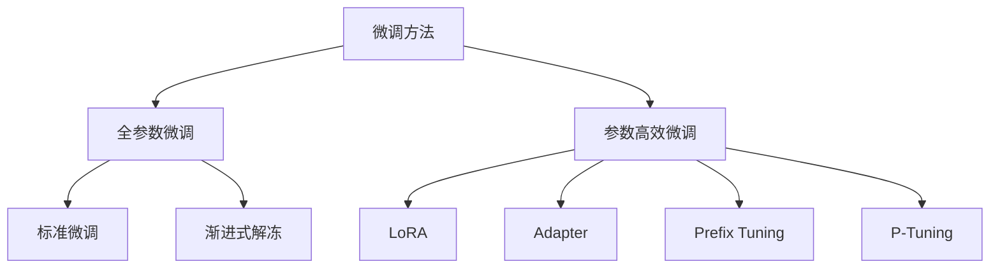

+++
title = '大模型微调参数'
+++

- [微调基础概念](#微调基础概念)
  - [什么是模型微调？](#什么是模型微调)
  - [微调的优势](#微调的优势)
  - [微调 vs 预训练](#微调-vs-预训练)
- [微调方法分类](#微调方法分类)
  - [1. 按参数更新范围分类](#1-按参数更新范围分类)
  - [2. 按训练策略分类](#2-按训练策略分类)
- [全参数微调](#全参数微调)
  - [实现步骤](#实现步骤)
  - [关键参数说明](#关键参数说明)
- [参数高效微调](#参数高效微调)
  - [1. LoRA (Low-Rank Adaptation)](#1-lora-low-rank-adaptation)
  - [2. Adapter 微调](#2-adapter-微调)
  - [3. Prefix Tuning](#3-prefix-tuning)
- [实践案例](#实践案例)
  - [案例1：指令微调](#案例1指令微调)
  - [案例2：对话微调](#案例2对话微调)
  - [案例3：代码生成微调](#案例3代码生成微调)
- [性能优化](#性能优化)
  - [1. 内存优化](#1-内存优化)
  - [2. 训练加速](#2-训练加速)
  - [3. 监控和调试](#3-监控和调试)
- [最佳实践](#最佳实践)
  - [1. 数据准备](#1-数据准备)
  - [2. 超参数调优](#2-超参数调优)
  - [3. 模型评估](#3-模型评估)
  - [4. 模型保存和部署](#4-模型保存和部署)
- [常见问题和解决方案](#常见问题和解决方案)
  - [1. 过拟合问题](#1-过拟合问题)
  - [2. 内存不足](#2-内存不足)
  - [3. 训练不稳定](#3-训练不稳定)
- [总结](#总结)
  - [选择建议](#选择建议)
  - [后续发展](#后续发展)

## 微调基础概念

### 什么是模型微调？

微调（Fine-tuning）是指在预训练模型的基础上，使用特定任务的数据集对模型参数进行进一步训练，以提升模型在目标任务上的表现。

### 微调的优势

- **效率高**：相比从头训练，所需时间和计算资源大幅减少
- **效果好**：利用预训练模型的通用知识，快速适应新任务
- **数据要求低**：即使数据量有限也能获得不错的效果

### 微调 vs 预训练

```txt
预训练阶段：
大量无标签文本 → 通用语言理解能力

微调阶段：
特定任务数据 → 针对性任务能力
```

## 微调方法分类

### 1. 按参数更新范围分类



### 2. 按训练策略分类

- **监督微调（SFT）**：使用标注数据直接训练
- **强化学习微调（RLHF）**：通过人类反馈优化模型
- **指令微调（Instruction Tuning）**：专门针对指令跟随能力

## 全参数微调

### 实现步骤

```python
import torch
import torch.nn as nn
from transformers import (
    AutoTokenizer, 
    AutoModelForCausalLM,
    TrainingArguments,
    Trainer
)

# 1. 加载预训练模型
model_name = "meta-llama/Llama-2-7b-hf"
tokenizer = AutoTokenizer.from_pretrained(model_name)
model = AutoModelForCausalLM.from_pretrained(
    model_name,
    torch_dtype=torch.float16,
    device_map="auto"
)

# 2. 准备数据集
class CustomDataset(torch.utils.data.Dataset):
    def __init__(self, texts, tokenizer, max_length=512):
        self.texts = texts
        self.tokenizer = tokenizer
        self.max_length = max_length
    
    def __len__(self):
        return len(self.texts)
    
    def __getitem__(self, idx):
        text = self.texts[idx]
        encoding = self.tokenizer(
            text,
            truncation=True,
            padding='max_length',
            max_length=self.max_length,
            return_tensors='pt'
        )
        return {
            'input_ids': encoding['input_ids'].flatten(),
            'attention_mask': encoding['attention_mask'].flatten(),
            'labels': encoding['input_ids'].flatten()
        }

# 3. 配置训练参数
training_args = TrainingArguments(
    output_dir='./results',
    num_train_epochs=3,
    per_device_train_batch_size=4,
    per_device_eval_batch_size=4,
    warmup_steps=500,
    weight_decay=0.01,
    logging_dir='./logs',
    gradient_accumulation_steps=8,
    learning_rate=5e-5,
    save_strategy="epoch",
    evaluation_strategy="epoch",
    fp16=True,  # 混合精度训练
)

# 4. 创建训练器
trainer = Trainer(
    model=model,
    args=training_args,
    train_dataset=train_dataset,
    eval_dataset=eval_dataset,
    tokenizer=tokenizer,
)

# 5. 开始训练
trainer.train()
```

### 关键参数说明

```python
# 学习率设置
learning_rates = {
    "小模型 (<1B)": "1e-4 to 5e-4",
    "中等模型 (1B-10B)": "5e-5 to 1e-4", 
    "大模型 (>10B)": "1e-5 to 5e-5"
}

# 批次大小建议
batch_sizes = {
    "GPU内存": "建议批次大小",
    "8GB": "1-2",
    "16GB": "2-4",
    "24GB": "4-8",
    "40GB+": "8-16"
}
```

## 参数高效微调

### 1. LoRA (Low-Rank Adaptation)

LoRA通过低秩分解减少可训练参数：

```python
from peft import LoraConfig, get_peft_model, TaskType

# LoRA配置
lora_config = LoraConfig(
    task_type=TaskType.CAUSAL_LM,
    inference_mode=False,
    r=16,  # 低秩维度
    lora_alpha=32,  # 缩放参数
    lora_dropout=0.1,  # Dropout率
    target_modules=["q_proj", "v_proj", "k_proj", "o_proj"]  # 目标层
)

# 应用LoRA
model = get_peft_model(model, lora_config)

# 查看可训练参数
model.print_trainable_parameters()
# 输出: trainable params: 4,194,304 || all params: 6,742,609,920 || trainable%: 0.06
```

### 2. Adapter 微调

```python
class AdapterLayer(nn.Module):
    def __init__(self, input_dim, adapter_dim=64):
        super().__init__()
        self.down_proj = nn.Linear(input_dim, adapter_dim)
        self.up_proj = nn.Linear(adapter_dim, input_dim)
        self.activation = nn.ReLU()
        self.dropout = nn.Dropout(0.1)
        
    def forward(self, x):
        # 残差连接
        adapter_output = self.up_proj(
            self.dropout(self.activation(self.down_proj(x)))
        )
        return x + adapter_output

# 在Transformer层中插入Adapter
class TransformerWithAdapter(nn.Module):
    def __init__(self, original_layer):
        super().__init__()
        self.original_layer = original_layer
        self.adapter = AdapterLayer(original_layer.config.hidden_size)
        
    def forward(self, x):
        x = self.original_layer(x)
        x = self.adapter(x)
        return x
```

### 3. Prefix Tuning

```python
class PrefixTuning(nn.Module):
    def __init__(self, config):
        super().__init__()
        self.prefix_length = 20
        self.hidden_size = config.hidden_size
        self.num_layers = config.num_hidden_layers
        
        # 可训练的前缀参数
        self.prefix_embeddings = nn.Parameter(
            torch.randn(self.prefix_length, self.hidden_size)
        )
        
    def forward(self, input_ids):
        batch_size = input_ids.shape[0]
        prefix = self.prefix_embeddings.unsqueeze(0).expand(
            batch_size, -1, -1
        )
        return prefix
```

## 实践案例

### 案例1：指令微调

```python
# 数据格式
instruction_data = [
    {
        "instruction": "将以下文本翻译成英文",
        "input": "你好，世界！",
        "output": "Hello, world!"
    },
    {
        "instruction": "总结以下段落的主要内容",
        "input": "人工智能是计算机科学的一个分支...",
        "output": "该段落介绍了人工智能的定义和应用..."
    }
]

# 数据预处理
def format_instruction(example):
    prompt = f"""### 指令:
{example['instruction']}

### 输入:
{example['input']}

### 输出:
{example['output']}"""
    return prompt

# 构建数据集
formatted_data = [format_instruction(item) for item in instruction_data]
```

### 案例2：对话微调

```python
# 对话数据格式
dialogue_data = [
    {
        "conversations": [
            {"from": "human", "value": "什么是机器学习？"},
            {"from": "gpt", "value": "机器学习是人工智能的一个子领域..."}
        ]
    }
]

def format_dialogue(example):
    conversation = ""
    for turn in example["conversations"]:
        if turn["from"] == "human":
            conversation += f"Human: {turn['value']}\n"
        else:
            conversation += f"Assistant: {turn['value']}\n"
    return conversation
```

### 案例3：代码生成微调

```python
# 代码数据格式
code_data = [
    {
        "problem": "编写一个函数计算斐波那契数列",
        "solution": """def fibonacci(n):
    if n <= 1:
        return n
    return fibonacci(n-1) + fibonacci(n-2)"""
    }
]

def format_code(example):
    return f"""问题: {example['problem']}

解决方案:
```python
{example['solution']}
```"""
```

## 性能优化

### 1. 内存优化

```python
# 梯度检查点
model.gradient_checkpointing_enable()

# DeepSpeed ZeRO
from deepspeed import zero
ds_config = {
    "zero_optimization": {
        "stage": 3,  # ZeRO-3
        "offload_optimizer": {
            "device": "cpu"
        },
        "offload_param": {
            "device": "cpu"
        }
    }
}

# 8-bit量化
from transformers import BitsAndBytesConfig
quantization_config = BitsAndBytesConfig(
    load_in_8bit=True,
    llm_int8_threshold=6.0
)

model = AutoModelForCausalLM.from_pretrained(
    model_name,
    quantization_config=quantization_config
)
```

### 2. 训练加速

```python
# 数据并行
import torch.distributed as dist
from torch.nn.parallel import DistributedDataParallel as DDP

# 混合精度训练
from torch.cuda.amp import autocast, GradScaler

scaler = GradScaler()

def training_step(model, batch):
    with autocast():
        outputs = model(**batch)
        loss = outputs.loss
    
    scaler.scale(loss).backward()
    scaler.step(optimizer)
    scaler.update()
    
    return loss
```

### 3. 监控和调试

```python
import wandb

# 初始化wandb
wandb.init(project="llm-fine-tuning")

# 自定义回调函数
class CustomCallback:
    def on_log(self, logs):
        # 记录损失
        wandb.log({
            "train_loss": logs.get("train_loss", 0),
            "eval_loss": logs.get("eval_loss", 0),
            "learning_rate": logs.get("learning_rate", 0)
        })
        
    def on_evaluate(self, eval_results):
        # 记录评估指标
        wandb.log(eval_results)
```

## 最佳实践

### 1. 数据准备

```python
# 数据清洗和预处理
def clean_text(text):
    # 移除特殊字符
    text = re.sub(r'[^\w\s]', '', text)
    # 标准化空白字符
    text = re.sub(r'\s+', ' ', text)
    return text.strip()

# 数据增强
def augment_data(examples, augment_ratio=0.2):
    augmented = []
    for example in examples:
        # 原始数据
        augmented.append(example)
        
        # 随机选择部分数据进行增强
        if random.random() < augment_ratio:
            # 同义词替换
            augmented_text = synonym_replace(example['text'])
            augmented.append({
                'text': augmented_text,
                'label': example['label']
            })
    
    return augmented
```

### 2. 超参数调优

```python
# 超参数搜索空间
hyperparameters = {
    'learning_rate': [1e-5, 5e-5, 1e-4, 5e-4],
    'batch_size': [4, 8, 16],
    'num_epochs': [3, 5, 10],
    'warmup_ratio': [0.1, 0.2, 0.3],
    'weight_decay': [0.01, 0.1, 0.2]
}

# 使用Optuna进行超参数优化
import optuna

def objective(trial):
    lr = trial.suggest_categorical('learning_rate', [1e-5, 5e-5, 1e-4])
    batch_size = trial.suggest_categorical('batch_size', [4, 8, 16])
    
    # 训练模型
    model = train_model(lr=lr, batch_size=batch_size)
    
    # 返回验证指标
    return evaluate_model(model)

study = optuna.create_study(direction='maximize')
study.optimize(objective, n_trials=50)
```

### 3. 模型评估

```python
# 评估指标
from sklearn.metrics import accuracy_score, f1_score, bleu_score

def evaluate_model(model, test_dataset):
    predictions = []
    references = []
    
    for batch in test_dataset:
        with torch.no_grad():
            outputs = model.generate(
                batch['input_ids'],
                max_length=512,
                temperature=0.7,
                do_sample=True
            )
        
        pred_text = tokenizer.decode(outputs[0], skip_special_tokens=True)
        ref_text = tokenizer.decode(batch['labels'][0], skip_special_tokens=True)
        
        predictions.append(pred_text)
        references.append(ref_text)
    
    # 计算BLEU分数
    bleu = bleu_score(predictions, references)
    
    return {
        'bleu': bleu,
        'predictions': predictions[:10],  # 保存前10个预测结果
        'references': references[:10]
    }
```

### 4. 模型保存和部署

```python
# 保存微调后的模型
def save_model(model, tokenizer, output_dir):
    model.save_pretrained(output_dir)
    tokenizer.save_pretrained(output_dir)
    
    # 保存训练配置
    config = {
        'model_name': model.config.name_or_path,
        'training_args': training_args.to_dict(),
        'fine_tuning_method': 'lora',
        'timestamp': datetime.now().isoformat()
    }
    
    with open(f"{output_dir}/training_config.json", 'w') as f:
        json.dump(config, f, indent=2)

# 加载和推理
def load_and_inference(model_path, input_text):
    model = AutoModelForCausalLM.from_pretrained(model_path)
    tokenizer = AutoTokenizer.from_pretrained(model_path)
    
    inputs = tokenizer(input_text, return_tensors="pt")
    outputs = model.generate(**inputs, max_length=512)
    
    return tokenizer.decode(outputs[0], skip_special_tokens=True)
```

## 常见问题和解决方案

### 1. 过拟合问题

```python
# 早停机制
from transformers import EarlyStoppingCallback

early_stopping = EarlyStoppingCallback(
    early_stopping_patience=3,
    early_stopping_threshold=0.01
)

trainer = Trainer(
    model=model,
    args=training_args,
    train_dataset=train_dataset,
    eval_dataset=eval_dataset,
    callbacks=[early_stopping]
)
```

### 2. 内存不足

```python
# 解决方案组合
solutions = {
    "减小批次大小": "per_device_train_batch_size=1",
    "梯度累积": "gradient_accumulation_steps=16",
    "梯度检查点": "gradient_checkpointing=True",
    "模型并行": "device_map='auto'",
    "量化": "load_in_8bit=True"
}
```

### 3. 训练不稳定

```python
# 稳定训练的技巧
stability_tips = {
    "学习率预热": "warmup_steps=500",
    "梯度裁剪": "max_grad_norm=1.0",
    "学习率衰减": "lr_scheduler_type='cosine'",
    "权重衰减": "weight_decay=0.01"
}
```

## 总结

大模型微调是一个复杂的过程，需要在效果、效率和资源之间找到平衡。选择合适的微调方法和超参数设置对最终效果至关重要。

### 选择建议

- **计算资源充足**：使用全参数微调
- **资源有限**：选择LoRA或Adapter
- **快速验证**：使用Prefix Tuning
- **生产部署**：考虑量化和剪枝

### 后续发展

- **更高效的PEFT方法**
- **自动化超参数优化**
- **多任务联合微调**
- **持续学习能力**

掌握这些微调技术，你就能根据具体需求选择最适合的方法，训练出性能优异的专用模型。

---

**作者**：meimeitou  
**标签**：#LLM #微调 #机器学习 #深度学习
