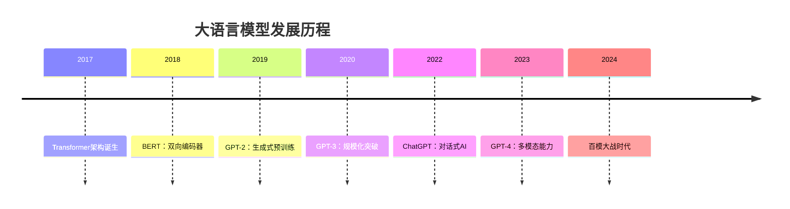

+++
title = '大语言模型LLM简介'
description = '全面介绍大语言模型的基本概念、技术原理、应用场景和未来发展趋势，帮助你深入理解这一前沿技术。'
tags = ['大语言模型', 'LLM', '人工智能', '自然语言处理']
categories = ['人工智能', '大语言模型']
+++

- [引言](#引言)
- [什么是大语言模型？](#什么是大语言模型)
  - [基本定义](#基本定义)
  - [技术演进历程](#技术演进历程)
- [技术架构深度解析](#技术架构深度解析)
  - [Transformer架构](#transformer架构)
    - [自注意力机制（Self-Attention）](#自注意力机制self-attention)
    - [位置编码（Positional Encoding）](#位置编码positional-encoding)
    - [多头注意力（Multi-Head Attention）](#多头注意力multi-head-attention)
  - [训练策略](#训练策略)
    - [预训练阶段](#预训练阶段)
    - [微调阶段](#微调阶段)
- [主流大语言模型对比](#主流大语言模型对比)
- [核心能力展示](#核心能力展示)
  - [1. 自然语言理解](#1-自然语言理解)
  - [2. 文本生成](#2-文本生成)
  - [3. 代码生成](#3-代码生成)
  - [4. 推理与问答](#4-推理与问答)
- [实际应用场景](#实际应用场景)
  - [🏢 企业应用](#-企业应用)
    - [客户服务](#客户服务)
    - [内容创作](#内容创作)
  - [🎓 教育领域](#-教育领域)
    - [个性化学习](#个性化学习)
    - [语言学习](#语言学习)
  - [💻 软件开发](#-软件开发)
    - [代码辅助](#代码辅助)
    - [测试自动化](#测试自动化)
  - [🏥 医疗健康](#-医疗健康)
    - [临床决策支持](#临床决策支持)
    - [患者沟通](#患者沟通)
- [技术挑战与限制](#技术挑战与限制)
  - [🚨 主要挑战](#-主要挑战)
    - [1. 幻觉问题（Hallucination）](#1-幻觉问题hallucination)
    - [2. 偏见与公平性](#2-偏见与公平性)
    - [3. 计算资源需求](#3-计算资源需求)
    - [4. 安全性风险](#4-安全性风险)
  - [🔧 技术限制](#-技术限制)
    - [上下文长度限制](#上下文长度限制)
    - [实时性问题](#实时性问题)
- [未来发展趋势](#未来发展趋势)
  - [🔮 技术演进方向](#-技术演进方向)
    - [1. 多模态融合](#1-多模态融合)
    - [2. 推理能力增强](#2-推理能力增强)
    - [3. 效率优化](#3-效率优化)
    - [4. 个性化定制](#4-个性化定制)
  - [🌟 应用前景展望](#-应用前景展望)
    - [短期（1-2年）](#短期1-2年)
    - [中期（3-5年）](#中期3-5年)
    - [长期（5-10年）](#长期5-10年)
- [如何学习和应用LLM](#如何学习和应用llm)
  - [🎯 学习路径](#-学习路径)
    - [初学者路径](#初学者路径)
    - [进阶路径](#进阶路径)
  - [🛠️ 实用工具推荐](#️-实用工具推荐)
    - [开发框架](#开发框架)
    - [部署工具](#部署工具)
    - [评估工具](#评估工具)
- [结语](#结语)
- [参考资料](#参考资料)

## 引言

在人工智能技术飞速发展的今天，大语言模型（Large Language Models，简称LLM）无疑是最引人注目的技术突破之一。从ChatGPT的横空出世到各种AI应用的百花齐放，LLM正在深刻改变着我们的工作和生活方式。本文将为大家全面介绍大语言模型的基本概念、技术原理、应用场景以及未来发展趋势。

## 什么是大语言模型？

### 基本定义

大语言模型是一种基于深度学习的人工智能系统，具有以下核心特征：

- **参数规模巨大**：通常包含数十亿甚至数万亿个参数
- **训练数据海量**：使用互联网上大量的文本数据进行训练
- **多任务能力**：能够处理各种自然语言处理任务
- **涌现能力**：随着规模增大，展现出意想不到的能力

### 技术演进历程



## 技术架构深度解析

### Transformer架构

大语言模型的核心是**Transformer架构**，其关键创新包括：

#### 自注意力机制（Self-Attention）

```python
# 简化的自注意力计算
def self_attention(query, key, value):
    attention_weights = softmax(query @ key.T / sqrt(d_k))
    output = attention_weights @ value
    return output
```

#### 位置编码（Positional Encoding）

由于Transformer没有循环结构，需要位置编码来理解序列中词语的位置关系。

#### 多头注意力（Multi-Head Attention）

通过多个注意力头并行处理，捕捉不同类型的语言关系。

### 训练策略

#### 预训练阶段

- **自监督学习**：通过预测下一个词来学习语言规律
- **掩码语言建模**：预测被遮蔽的词语
- **海量数据**：使用TB级别的文本数据

#### 微调阶段

- **有监督微调（SFT）**：使用特定任务数据进行优化
- **人类反馈强化学习（RLHF）**：通过人类偏好改进模型行为
- **指令调优**：提升模型遵循指令的能力

## 主流大语言模型对比

| 模型 | 开发者 | 参数规模 | 特点 | 开源状态 |
|------|--------|----------|------|----------|
| GPT-4 | OpenAI | 未公开 | 多模态、推理能力强 | 闭源 |
| Claude 3 | Anthropic | 未公开 | 安全性高、长上下文 | 闭源 |
| Llama 3 | Meta | 8B-405B | 性能优秀、开源友好 | 开源 |
| 文心一言 | 百度 | 未公开 | 中文优化 | 闭源 |
| 通义千问 | 阿里巴巴 | 72B | 多语言支持 | 部分开源 |
| ChatGLM | 清华大学 | 6B-130B | 中英双语 | 开源 |

## 核心能力展示

### 1. 自然语言理解

LLM能够深度理解文本的语义、情感和意图：

**示例：情感分析**

```
输入：今天的天气真是糟糕透了，下了一整天的雨。
输出：负面情感 - 用户对天气表达不满
```

### 2. 文本生成

从创意写作到技术文档，LLM都能胜任：

**示例：诗歌创作**

```
题目：春天
生成：
春风轻抚柳絮飞，
桃花满树映朝辉。
莺歌燕舞传佳音，
万物复苏展新姿。
```

### 3. 代码生成

LLM在软件开发中展现出强大的辅助能力：

**示例：Python函数生成**

```python
# 需求：计算斐波那契数列
def fibonacci(n):
    """计算斐波那契数列的第n项"""
    if n <= 1:
        return n
    return fibonacci(n-1) + fibonacci(n-2)
```

### 4. 推理与问答

LLM具备一定的逻辑推理能力：

**示例：数学应用题**

```
问题：小明有15个苹果，给了小红5个，又买了8个，现在有多少个？
推理：15 - 5 + 8 = 18
答案：小明现在有18个苹果。
```

## 实际应用场景

### 🏢 企业应用

#### 客户服务

- **智能客服**：24/7自动响应客户咨询
- **问题分类**：自动识别和路由客户问题
- **知识库问答**：基于企业文档的智能问答

#### 内容创作

- **营销文案**：自动生成广告文案和产品描述
- **社交媒体**：批量生成社交媒体内容
- **新闻摘要**：自动提取和总结新闻要点

### 🎓 教育领域

#### 个性化学习

- **智能辅导**：根据学生水平提供个性化指导
- **作业批改**：自动批改和反馈学生作业
- **学习路径**：制定个性化学习计划

#### 语言学习

- **对话练习**：提供沉浸式语言对话环境
- **语法检查**：实时纠正语法错误
- **翻译辅助**：高质量的多语言翻译

### 💻 软件开发

#### 代码辅助

- **代码补全**：智能预测和补全代码
- **Bug修复**：自动识别和修复代码问题
- **文档生成**：自动生成代码文档和注释

#### 测试自动化

- **测试用例生成**：自动创建测试场景
- **代码审查**：智能代码质量检查
- **性能优化**：提供代码优化建议

### 🏥 医疗健康

#### 临床决策支持

- **症状分析**：辅助医生进行初步诊断
- **药物相互作用**：检查药物配伍禁忌
- **医学文献检索**：快速检索相关研究

#### 患者沟通

- **健康咨询**：提供基础健康信息
- **用药提醒**：智能用药指导
- **康复建议**：个性化康复方案

## 技术挑战与限制

### 🚨 主要挑战

#### 1. 幻觉问题（Hallucination）

- **定义**：模型生成看似合理但实际错误的信息
- **影响**：降低模型可信度，限制在关键应用中的使用
- **解决方案**：
  - 增强训练数据质量
  - 引入事实检查机制
  - 提供信息来源引用

#### 2. 偏见与公平性

- **数据偏见**：训练数据中的社会偏见被模型学习
- **算法偏见**：模型架构可能放大某些偏见
- **缓解措施**：
  - 数据去偏技术
  - 公平性评估指标
  - 多样化团队参与开发

#### 3. 计算资源需求

- **训练成本**：需要大量GPU/TPU资源
- **推理成本**：实时服务需要高性能硬件
- **优化方向**：
  - 模型压缩技术
  - 量化和剪枝
  - 边缘计算部署

#### 4. 安全性风险

- **恶意使用**：生成虚假信息、深度伪造
- **隐私泄露**：可能输出训练数据中的敏感信息
- **防护措施**：
  - 内容过滤系统
  - 差分隐私技术
  - 使用条款限制

### 🔧 技术限制

#### 上下文长度限制

```txt
当前限制：
- GPT-4: ~32K tokens
- Claude-3: ~200K tokens
- Llama-3: ~8K tokens

未来趋势：向无限长度上下文发展
```

#### 实时性问题

- 知识截止时间限制
- 无法获取最新信息
- 需要外部工具集成

## 未来发展趋势

### 🔮 技术演进方向

#### 1. 多模态融合

- **视觉+语言**：图像理解和生成
- **音频+语言**：语音对话和音乐创作
- **视频+语言**：视频理解和编辑
- **3D+语言**：三维场景理解

#### 2. 推理能力增强

- **逻辑推理**：更强的数学和逻辑能力
- **因果推理**：理解因果关系
- **常识推理**：更好的常识理解
- **创造性推理**：原创性思考能力

#### 3. 效率优化

- **模型压缩**：保持性能的同时减小模型体积
- **推理加速**：提高推理速度，降低延迟
- **能耗优化**：减少训练和推理的能源消耗
- **边缘部署**：在移动设备上运行大模型

#### 4. 个性化定制

- **个人助手**：深度理解用户偏好和习惯
- **领域专精**：针对特定行业的专业模型
- **文化适应**：更好地理解不同文化背景
- **价值观对齐**：与人类价值观保持一致

### 🌟 应用前景展望

#### 短期（1-2年）

- **更好的代码助手**：提高开发效率
- **智能办公套件**：文档、邮件、会议智能化
- **教育个性化**：因材施教的AI教师
- **创意工具升级**：设计、写作、音乐创作

#### 中期（3-5年）

- **通用人工智能雏形**：接近人类水平的通用能力
- **自主研究助手**：协助科学研究和发现
- **智能决策系统**：复杂环境下的决策支持
- **虚拟化身**：高度拟人的AI伙伴

#### 长期（5-10年）

- **科学发现加速器**：自主进行科学研究
- **全领域专家系统**：在各个专业领域达到专家水平
- **创意产业革命**：AI成为重要的创意合作伙伴
- **社会治理优化**：辅助社会管理和政策制定

## 如何学习和应用LLM

### 🎯 学习路径

#### 初学者路径

1. **基础知识**
   - 机器学习基础
   - 深度学习原理
   - 自然语言处理入门

2. **实践体验**
   - 使用现有LLM服务（ChatGPT、Claude等）
   - 尝试不同的提示工程技巧
   - 探索各种应用场景

3. **工具掌握**
   - 学习API调用
   - 掌握Prompt Engineering
   - 了解模型微调基础

#### 进阶路径

1. **理论深入**
   - Transformer架构详解
   - 注意力机制原理
   - 训练算法和优化技术

2. **实践项目**
   - 微调开源模型
   - 构建领域应用
   - 模型评估和优化

3. **前沿跟踪**
   - 阅读最新研究论文
   - 参与开源项目
   - 关注技术发展趋势

### 🛠️ 实用工具推荐

#### 开发框架

- **Hugging Face Transformers**：最流行的模型库
- **LangChain**：LLM应用开发框架
- **LlamaIndex**：数据索引和检索
- **OpenAI API**：商业模型接口

#### 部署工具

- **Ollama**：本地模型管理
- **vLLM**：高性能推理服务
- **TensorRT-LLM**：NVIDIA优化引擎
- **MLflow**：模型生命周期管理

#### 评估工具

- **BLEU/ROUGE**：文本质量评估
- **BERTScore**：语义相似度
- **Human Eval**：代码生成评估
- **HELM**：全面评估基准

## 结语

大语言模型代表了人工智能技术的一个重要里程碑，它不仅展现了机器在语言理解和生成方面的突破性进展，更为各行各业带来了前所未有的机遇和挑战。

作为这个激动人心时代的见证者和参与者，我们既要拥抱LLM技术带来的便利和可能性，也要理性看待其局限性和风险。只有在深入理解技术本质的基础上，我们才能更好地利用这一强大工具，推动社会进步和人类福祉。

无论你是技术从业者、研究学者，还是普通用户，LLM都将在不同程度上影响你的工作和生活。保持学习的心态，积极探索应用可能性，同时关注技术发展的伦理和社会影响，这将是我们在AI时代的必修课。

未来已来，让我们一起迎接这个由大语言模型开启的智能新时代！

---

## 参考资料

- [Attention Is All You Need](https://arxiv.org/abs/1706.03762) - Transformer原论文
- [Language Models are Few-Shot Learners](https://arxiv.org/abs/2005.14165) - GPT-3论文
- [Training language models to follow instructions](https://arxiv.org/abs/2203.02155) - InstructGPT论文
- [LLaMA: Open and Efficient Foundation Language Models](https://arxiv.org/abs/2302.13971) - LLaMA论文
- [Hugging Face文档](https://huggingface.co/docs) - 实用工具文档
- [OpenAI研究博客](https://openai.com/research/) - 最新研究进展

"*本文持续更新中，欢迎关注最新版本*"

**作者简介：** meimeitou，专注于人工智能技术研究与应用，致力于分享前沿技术知识和实践经验。
