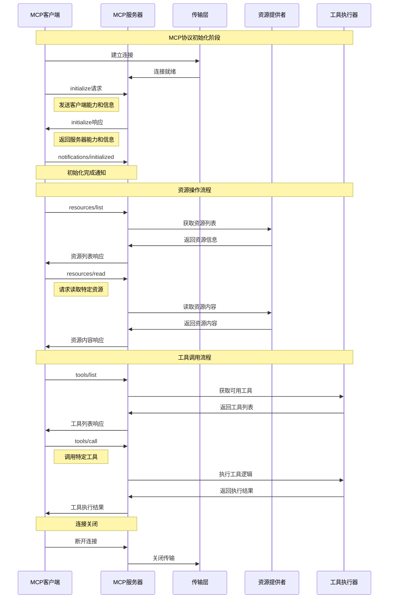
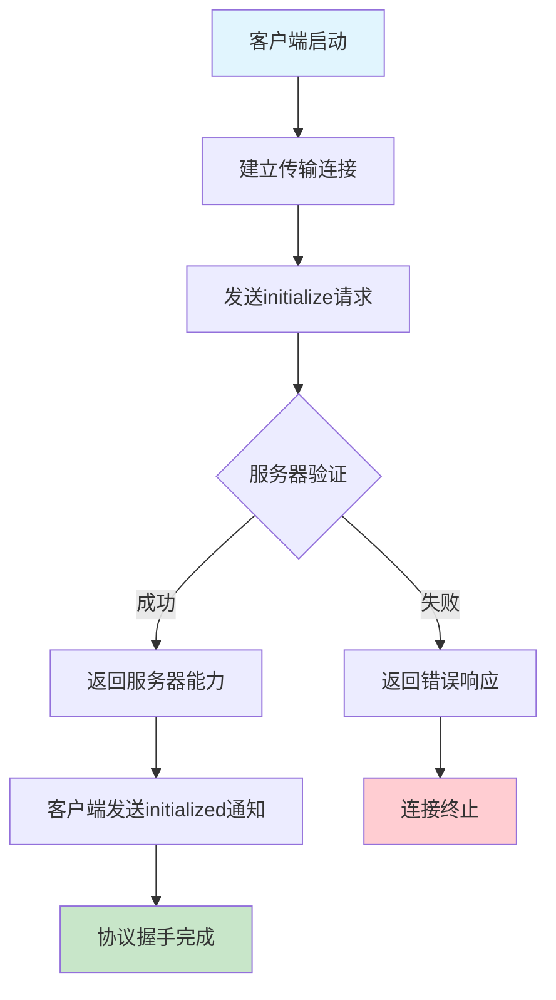
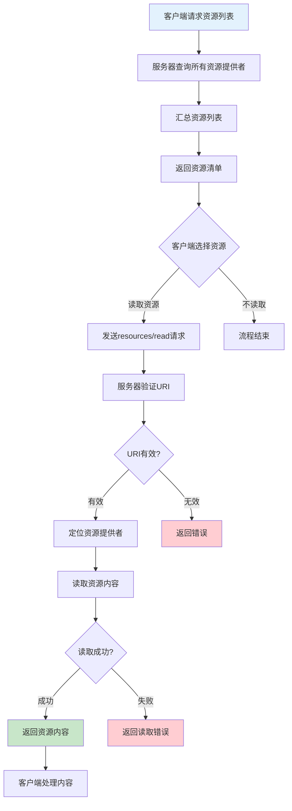
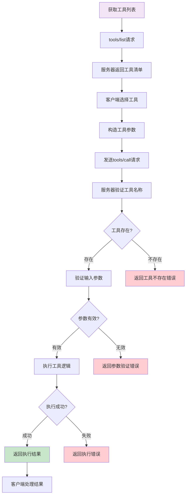
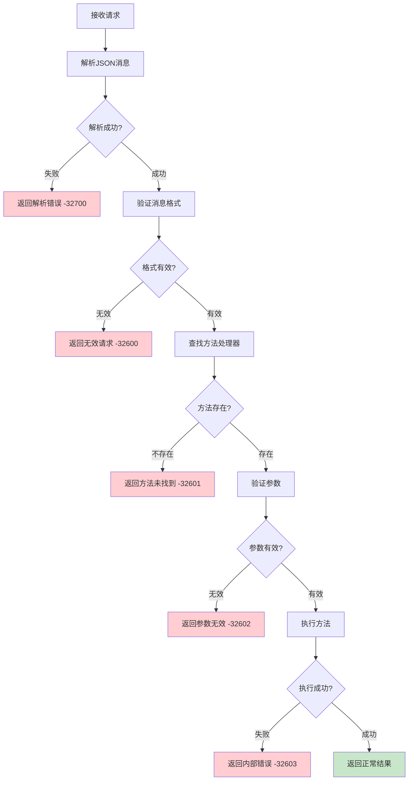
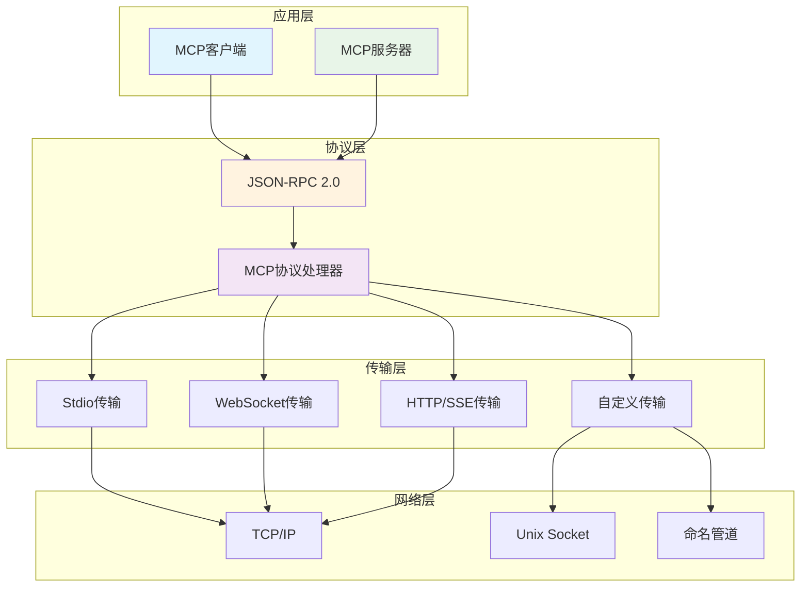
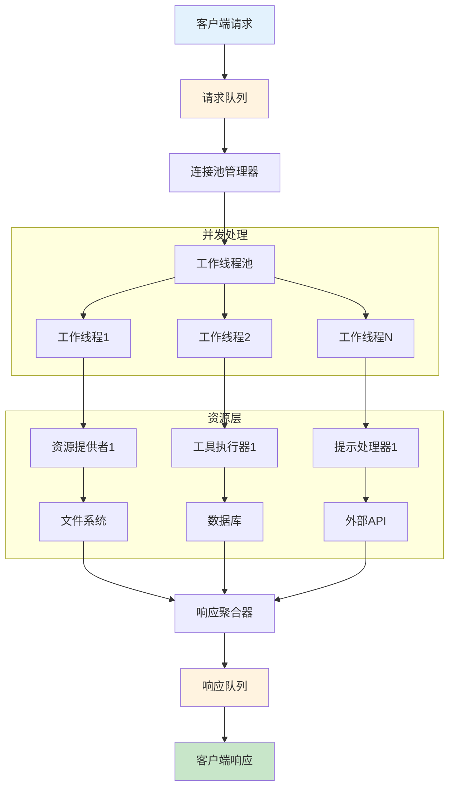
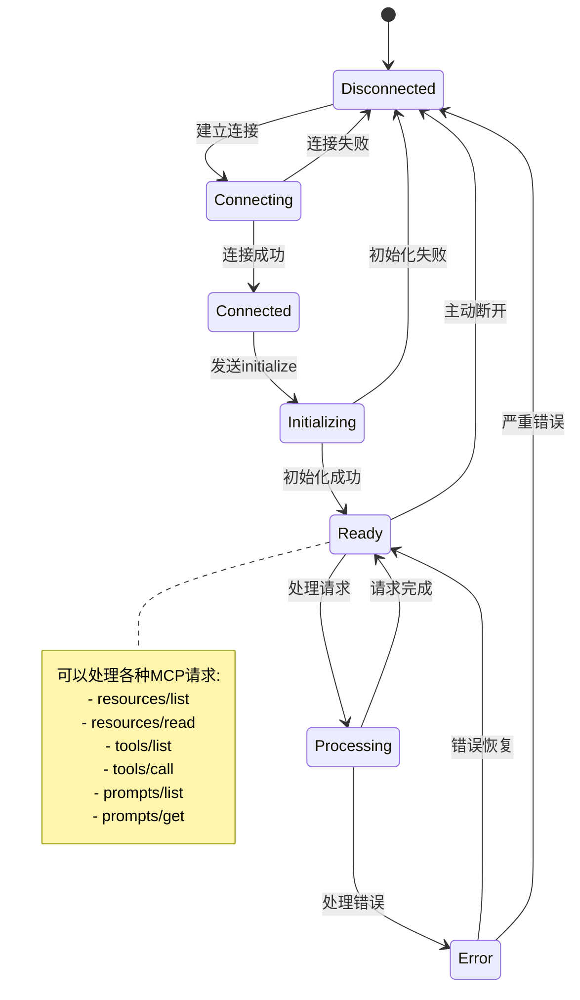

+++
date = '2025-08-14T15:30:00+08:00'
title = 'MCP实现原理深度解析'
description = '深入解析Model Context Protocol的底层实现原理，包括协议规范、消息格式、传输机制和核心算法'
tags = ['MCP', '协议实现', '系统架构', 'JSON-RPC']
categories = ['技术架构', '协议设计']
+++

Model Context Protocol（MCP）作为连接AI助手与外部世界的桥梁，其底层实现涉及多个技术层面。本文将深入解析MCP的实现原理，帮助开发者理解这一前沿协议的技术细节。

## 协议基础架构

### JSON-RPC 2.0 基础

MCP 建立在 JSON-RPC 2.0 协议之上，这为其提供了标准化的消息传递机制：

```json
{
  "jsonrpc": "2.0",
  "id": 1,
  "method": "initialize",
  "params": {
    "protocolVersion": "2024-11-05",
    "capabilities": {
      "roots": {
        "listChanged": true
      },
      "sampling": {}
    },
    "clientInfo": {
      "name": "example-client",
      "version": "1.0.0"
    }
  }
}
```

### 消息类型定义

MCP 定义了四种基本消息类型：

```python
from enum import Enum
from typing import Dict, Any, Optional, Union
from dataclasses import dataclass

class MessageType(Enum):
    REQUEST = "request"
    RESPONSE = "response" 
    NOTIFICATION = "notification"
    ERROR = "error"

@dataclass
class MCPMessage:
    jsonrpc: str = "2.0"
    id: Optional[Union[str, int]] = None
    method: Optional[str] = None
    params: Optional[Dict[str, Any]] = None
    result: Optional[Any] = None
    error: Optional[Dict[str, Any]] = None
```

## 流程图

### 1. 完整协议交互流程



### 2. 初始化协商流程



### 3. 资源访问流程



### 4. 工具执行流程



### 5. 错误处理流程



### 6. 传输层抽象架构



### 7. 并发处理架构



### 8. 状态机流程



## 核心协议实现

### 1. 连接初始化流程

```python
import asyncio
import json
from typing import Dict, Any, Callable

class MCPConnection:
    """MCP 连接管理器"""
    
    def __init__(self):
        self.capabilities = {}
        self.client_info = {}
        self.server_info = {}
        self.initialized = False
        self.message_handlers = {}
        self.request_id_counter = 0
        
    async def initialize(self, client_capabilities: Dict[str, Any]) -> Dict[str, Any]:
        """初始化 MCP 连接"""
        
        # 构造初始化请求
        initialize_request = {
            "jsonrpc": "2.0",
            "id": self._next_request_id(),
            "method": "initialize",
            "params": {
                "protocolVersion": "2024-11-05",
                "capabilities": client_capabilities,
                "clientInfo": {
                    "name": "python-mcp-client",
                    "version": "1.0.0"
                }
            }
        }
        
        # 发送初始化请求
        response = await self._send_request(initialize_request)
        
        if "error" in response:
            raise Exception(f"初始化失败: {response['error']}")
            
        # 保存服务器信息和能力
        result = response["result"]
        self.server_info = result.get("serverInfo", {})
        self.capabilities = result.get("capabilities", {})
        
        # 发送初始化完成通知
        await self._send_notification({
            "jsonrpc": "2.0",
            "method": "notifications/initialized"
        })
        
        self.initialized = True
        return result
    
    def _next_request_id(self) -> int:
        """生成下一个请求ID"""
        self.request_id_counter += 1
        return self.request_id_counter
```

### 2. 资源管理实现

```python
from abc import ABC, abstractmethod
from typing import List, Optional
import mimetypes
import os

class Resource:
    """MCP 资源定义"""
    
    def __init__(self, uri: str, name: str, description: str = "", 
                 mime_type: str = None, annotations: Dict[str, Any] = None):
        self.uri = uri
        self.name = name
        self.description = description
        self.mime_type = mime_type or self._detect_mime_type(uri)
        self.annotations = annotations or {}
    
    def _detect_mime_type(self, uri: str) -> str:
        """自动检测MIME类型"""
        mime_type, _ = mimetypes.guess_type(uri)
        return mime_type or "application/octet-stream"

class ResourceProvider(ABC):
    """资源提供者抽象基类"""
    
    @abstractmethod
    async def list_resources(self) -> List[Resource]:
        """列出所有可用资源"""
        pass
    
    @abstractmethod
    async def read_resource(self, uri: str) -> Dict[str, Any]:
        """读取指定资源内容"""
        pass

class FileResourceProvider(ResourceProvider):
    """文件系统资源提供者"""
    
    def __init__(self, base_path: str, allowed_extensions: List[str] = None):
        self.base_path = os.path.abspath(base_path)
        self.allowed_extensions = allowed_extensions or ['.txt', '.md', '.py', '.json']
    
    async def list_resources(self) -> List[Resource]:
        """列出目录中的所有文件资源"""
        resources = []
        
        for root, dirs, files in os.walk(self.base_path):
            for file in files:
                if self._is_allowed_file(file):
                    file_path = os.path.join(root, file)
                    relative_path = os.path.relpath(file_path, self.base_path)
                    uri = f"file://{file_path}"
                    
                    resource = Resource(
                        uri=uri,
                        name=relative_path,
                        description=f"文件: {relative_path}"
                    )
                    resources.append(resource)
        
        return resources
    
    async def read_resource(self, uri: str) -> Dict[str, Any]:
        """读取文件资源内容"""
        if not uri.startswith("file://"):
            raise ValueError("无效的文件URI")
        
        file_path = uri[7:]  # 移除 "file://" 前缀
        
        if not self._is_safe_path(file_path):
            raise ValueError("路径不安全")
        
        try:
            with open(file_path, 'r', encoding='utf-8') as f:
                content = f.read()
            
            return {
                "contents": [{
                    "type": "text",
                    "text": content
                }]
            }
        except Exception as e:
            raise Exception(f"读取文件失败: {str(e)}")
    
    def _is_allowed_file(self, filename: str) -> bool:
        """检查文件是否允许访问"""
        _, ext = os.path.splitext(filename)
        return ext.lower() in self.allowed_extensions
    
    def _is_safe_path(self, path: str) -> bool:
        """检查路径是否安全（防止路径遍历攻击）"""
        abs_path = os.path.abspath(path)
        return abs_path.startswith(self.base_path)
```

### 3. 工具执行引擎

```python
from typing import Dict, Any, Callable, Awaitable
import inspect
import json
from jsonschema import validate, ValidationError

class Tool:
    """MCP 工具定义"""
    
    def __init__(self, name: str, description: str, 
                 input_schema: Dict[str, Any], handler: Callable):
        self.name = name
        self.description = description
        self.input_schema = input_schema
        self.handler = handler
        self._validate_handler()
    
    def _validate_handler(self):
        """验证处理函数签名"""
        sig = inspect.signature(self.handler)
        if not inspect.iscoroutinefunction(self.handler):
            raise ValueError(f"工具处理函数 {self.name} 必须是异步函数")

class ToolRegistry:
    """工具注册表"""
    
    def __init__(self):
        self.tools: Dict[str, Tool] = {}
    
    def register_tool(self, tool: Tool):
        """注册工具"""
        self.tools[tool.name] = tool
    
    def get_tool_list(self) -> List[Dict[str, Any]]:
        """获取工具列表"""
        return [
            {
                "name": tool.name,
                "description": tool.description,
                "inputSchema": tool.input_schema
            }
            for tool in self.tools.values()
        ]
    
    async def call_tool(self, name: str, arguments: Dict[str, Any]) -> Dict[str, Any]:
        """调用工具"""
        if name not in self.tools:
            raise ValueError(f"未找到工具: {name}")
        
        tool = self.tools[name]
        
        # 验证输入参数
        try:
            validate(arguments, tool.input_schema)
        except ValidationError as e:
            raise ValueError(f"参数验证失败: {str(e)}")
        
        # 调用工具处理函数
        try:
            result = await tool.handler(**arguments)
            return {
                "content": [
                    {
                        "type": "text", 
                        "text": json.dumps(result, ensure_ascii=False, indent=2)
                    }
                ]
            }
        except Exception as e:
            raise Exception(f"工具执行失败: {str(e)}")

# 工具装饰器
def mcp_tool(name: str, description: str, input_schema: Dict[str, Any]):
    """MCP 工具装饰器"""
    def decorator(func: Callable):
        tool = Tool(name, description, input_schema, func)
        # 这里可以自动注册到全局注册表
        return tool
    return decorator

# 使用示例
@mcp_tool(
    name="calculate",
    description="执行数学计算",
    input_schema={
        "type": "object",
        "properties": {
            "expression": {
                "type": "string",
                "description": "数学表达式"
            }
        },
        "required": ["expression"]
    }
)
async def calculate_tool(expression: str) -> Dict[str, Any]:
    """计算器工具"""
    try:
        # 安全的表达式求值（仅限基本数学运算）
        allowed_names = {
            k: v for k, v in __builtins__.items() 
            if k in ['abs', 'round', 'min', 'max', 'sum']
        }
        allowed_names.update({'__builtins__': {}})
        
        result = eval(expression, allowed_names)
        return {"result": result}
    except Exception as e:
        return {"error": f"计算错误: {str(e)}"}
```

### 4. 传输层抽象

```python
from abc import ABC, abstractmethod
import asyncio
import sys
from typing import AsyncIterator, Tuple, Optional

class Transport(ABC):
    """传输层抽象接口"""
    
    @abstractmethod
    async def read_message(self) -> Optional[Dict[str, Any]]:
        """读取一条消息"""
        pass
    
    @abstractmethod
    async def write_message(self, message: Dict[str, Any]):
        """写入一条消息"""
        pass
    
    @abstractmethod
    async def close(self):
        """关闭传输连接"""
        pass

class StdioTransport(Transport):
    """标准输入输出传输实现"""
    
    def __init__(self):
        self.reader = None
        self.writer = None
    
    async def initialize(self):
        """初始化stdio传输"""
        self.reader = asyncio.StreamReader()
        protocol = asyncio.StreamReaderProtocol(self.reader)
        
        loop = asyncio.get_event_loop()
        await loop.connect_read_pipe(lambda: protocol, sys.stdin)
        
        transport, protocol = await loop.connect_write_pipe(
            asyncio.streams.FlowControlMixin, sys.stdout
        )
        self.writer = asyncio.StreamWriter(transport, protocol, self.reader, loop)
    
    async def read_message(self) -> Optional[Dict[str, Any]]:
        """从stdin读取JSON消息"""
        try:
            line = await self.reader.readline()
            if not line:
                return None
            
            message_text = line.decode('utf-8').strip()
            if not message_text:
                return None
            
            return json.loads(message_text)
        except json.JSONDecodeError as e:
            raise Exception(f"JSON解析错误: {str(e)}")
        except Exception as e:
            raise Exception(f"读取消息失败: {str(e)}")
    
    async def write_message(self, message: Dict[str, Any]):
        """向stdout写入JSON消息"""
        try:
            message_text = json.dumps(message, ensure_ascii=False)
            self.writer.write((message_text + '\n').encode('utf-8'))
            await self.writer.drain()
        except Exception as e:
            raise Exception(f"写入消息失败: {str(e)}")
    
    async def close(self):
        """关闭传输连接"""
        if self.writer:
            self.writer.close()
            await self.writer.wait_closed()

class HTTPTransport(Transport):
    """HTTP传输实现（WebSocket或Server-Sent Events）"""
    
    def __init__(self, url: str, transport_type: str = "websocket"):
        self.url = url
        self.transport_type = transport_type
        self.websocket = None
        self.session = None
    
    async def initialize(self):
        """初始化HTTP传输"""
        if self.transport_type == "websocket":
            import websockets
            self.websocket = await websockets.connect(self.url)
        elif self.transport_type == "sse":
            import aiohttp
            self.session = aiohttp.ClientSession()
    
    async def read_message(self) -> Optional[Dict[str, Any]]:
        """从WebSocket或SSE读取消息"""
        if self.transport_type == "websocket" and self.websocket:
            try:
                message_text = await self.websocket.recv()
                return json.loads(message_text)
            except Exception as e:
                raise Exception(f"WebSocket读取失败: {str(e)}")
        # SSE实现略...
        return None
    
    async def write_message(self, message: Dict[str, Any]):
        """向WebSocket写入消息"""
        if self.transport_type == "websocket" and self.websocket:
            try:
                message_text = json.dumps(message, ensure_ascii=False)
                await self.websocket.send(message_text)
            except Exception as e:
                raise Exception(f"WebSocket写入失败: {str(e)}")
    
    async def close(self):
        """关闭HTTP传输"""
        if self.websocket:
            await self.websocket.close()
        if self.session:
            await self.session.close()
```

### 5. 完整的MCP服务器实现

```python
import logging
from typing import Dict, Any, List, Optional, Callable

class MCPServer:
    """完整的MCP服务器实现"""
    
    def __init__(self, name: str, version: str = "1.0.0"):
        self.name = name
        self.version = version
        self.transport = None
        self.resource_providers = []
        self.tool_registry = ToolRegistry()
        self.prompt_registry = {}
        self.logger = logging.getLogger(f"mcp.{name}")
        
        # 消息处理器映射
        self.message_handlers = {
            "initialize": self._handle_initialize,
            "resources/list": self._handle_list_resources,
            "resources/read": self._handle_read_resource,
            "tools/list": self._handle_list_tools,
            "tools/call": self._handle_call_tool,
            "prompts/list": self._handle_list_prompts,
            "prompts/get": self._handle_get_prompt
        }
    
    def add_resource_provider(self, provider: ResourceProvider):
        """添加资源提供者"""
        self.resource_providers.append(provider)
    
    def register_tool(self, tool: Tool):
        """注册工具"""
        self.tool_registry.register_tool(tool)
    
    async def run(self, transport: Transport):
        """运行MCP服务器"""
        self.transport = transport
        await transport.initialize()
        
        self.logger.info(f"MCP服务器 {self.name} 已启动")
        
        try:
            while True:
                message = await transport.read_message()
                if message is None:
                    break
                
                await self._handle_message(message)
                
        except Exception as e:
            self.logger.error(f"服务器运行错误: {str(e)}")
        finally:
            await transport.close()
    
    async def _handle_message(self, message: Dict[str, Any]):
        """处理接收到的消息"""
        try:
            method = message.get("method")
            message_id = message.get("id")
            params = message.get("params", {})
            
            if method in self.message_handlers:
                handler = self.message_handlers[method]
                result = await handler(params)
                
                if message_id is not None:
                    # 发送响应
                    response = {
                        "jsonrpc": "2.0",
                        "id": message_id,
                        "result": result
                    }
                    await self.transport.write_message(response)
            else:
                # 未知方法
                if message_id is not None:
                    error_response = {
                        "jsonrpc": "2.0",
                        "id": message_id,
                        "error": {
                            "code": -32601,
                            "message": f"未知方法: {method}"
                        }
                    }
                    await self.transport.write_message(error_response)
                    
        except Exception as e:
            self.logger.error(f"处理消息错误: {str(e)}")
            if message.get("id") is not None:
                error_response = {
                    "jsonrpc": "2.0", 
                    "id": message.get("id"),
                    "error": {
                        "code": -32603,
                        "message": f"内部错误: {str(e)}"
                    }
                }
                await self.transport.write_message(error_response)
    
    async def _handle_initialize(self, params: Dict[str, Any]) -> Dict[str, Any]:
        """处理初始化请求"""
        client_capabilities = params.get("capabilities", {})
        
        return {
            "protocolVersion": "2024-11-05",
            "capabilities": {
                "resources": {
                    "subscribe": False,
                    "listChanged": True
                },
                "tools": {
                    "listChanged": True
                },
                "prompts": {
                    "listChanged": True
                },
                "logging": {}
            },
            "serverInfo": {
                "name": self.name,
                "version": self.version
            }
        }
    
    async def _handle_list_resources(self, params: Dict[str, Any]) -> Dict[str, Any]:
        """处理资源列表请求"""
        all_resources = []
        
        for provider in self.resource_providers:
            resources = await provider.list_resources()
            for resource in resources:
                all_resources.append({
                    "uri": resource.uri,
                    "name": resource.name,
                    "description": resource.description,
                    "mimeType": resource.mime_type
                })
        
        return {"resources": all_resources}
    
    async def _handle_read_resource(self, params: Dict[str, Any]) -> Dict[str, Any]:
        """处理资源读取请求"""
        uri = params.get("uri")
        if not uri:
            raise ValueError("缺少URI参数")
        
        for provider in self.resource_providers:
            try:
                return await provider.read_resource(uri)
            except Exception:
                continue
        
        raise ValueError(f"未找到资源: {uri}")
    
    async def _handle_list_tools(self, params: Dict[str, Any]) -> Dict[str, Any]:
        """处理工具列表请求"""
        return {"tools": self.tool_registry.get_tool_list()}
    
    async def _handle_call_tool(self, params: Dict[str, Any]) -> Dict[str, Any]:
        """处理工具调用请求"""
        name = params.get("name")
        arguments = params.get("arguments", {})
        
        if not name:
            raise ValueError("缺少工具名称")
        
        return await self.tool_registry.call_tool(name, arguments)
    
    async def _handle_list_prompts(self, params: Dict[str, Any]) -> Dict[str, Any]:
        """处理提示列表请求"""
        return {"prompts": list(self.prompt_registry.values())}
    
    async def _handle_get_prompt(self, params: Dict[str, Any]) -> Dict[str, Any]:
        """处理获取提示请求"""
        name = params.get("name")
        arguments = params.get("arguments", {})
        
        if name not in self.prompt_registry:
            raise ValueError(f"未找到提示: {name}")
        
        prompt = self.prompt_registry[name]
        # 这里需要根据arguments渲染提示模板
        return prompt
```

## 使用示例

```python
async def main():
    # 创建MCP服务器
    server = MCPServer("example-server")
    
    # 添加文件资源提供者
    file_provider = FileResourceProvider("/tmp/mcp-resources")
    server.add_resource_provider(file_provider)
    
    # 注册计算器工具
    server.register_tool(calculate_tool)
    
    # 使用stdio传输运行服务器
    transport = StdioTransport()
    await server.run(transport)

if __name__ == "__main__":
    asyncio.run(main())
```

## 协议扩展机制

### 自定义能力声明

```python
class ExtendedMCPServer(MCPServer):
    """扩展MCP服务器"""
    
    async def _handle_initialize(self, params: Dict[str, Any]) -> Dict[str, Any]:
        """处理初始化请求（包含自定义能力）"""
        base_result = await super()._handle_initialize(params)
        
        # 添加自定义能力
        base_result["capabilities"]["experimental"] = {
            "customFeature": {
                "version": "1.0"
            }
        }
        
        return base_result
```

### 消息拦截器

```python
class MessageInterceptor:
    """消息拦截器"""
    
    async def before_handle(self, message: Dict[str, Any]) -> Dict[str, Any]:
        """消息处理前拦截"""
        return message
    
    async def after_handle(self, message: Dict[str, Any], result: Any) -> Any:
        """消息处理后拦截"""
        return result

class InterceptorMCPServer(MCPServer):
    """支持拦截器的MCP服务器"""
    
    def __init__(self, *args, **kwargs):
        super().__init__(*args, **kwargs)
        self.interceptors: List[MessageInterceptor] = []
    
    def add_interceptor(self, interceptor: MessageInterceptor):
        """添加消息拦截器"""
        self.interceptors.append(interceptor)
    
    async def _handle_message(self, message: Dict[str, Any]):
        """处理消息（包含拦截器支持）"""
        # 前置拦截
        for interceptor in self.interceptors:
            message = await interceptor.before_handle(message)
        
        # 原始处理逻辑...
        result = await super()._handle_message(message)
        
        # 后置拦截
        for interceptor in self.interceptors:
            result = await interceptor.after_handle(message, result)
        
        return result
```

## 性能优化策略

### 1. 连接池管理

```python
class ConnectionPool:
    """MCP连接池"""
    
    def __init__(self, max_connections: int = 10):
        self.max_connections = max_connections
        self.active_connections = {}
        self.connection_semaphore = asyncio.Semaphore(max_connections)
    
    async def get_connection(self, client_id: str) -> MCPConnection:
        """获取或创建连接"""
        async with self.connection_semaphore:
            if client_id not in self.active_connections:
                self.active_connections[client_id] = MCPConnection()
            return self.active_connections[client_id]
    
    async def release_connection(self, client_id: str):
        """释放连接"""
        if client_id in self.active_connections:
            await self.active_connections[client_id].close()
            del self.active_connections[client_id]
```

### 2. 缓存机制

```python
from functools import wraps
import time
from typing import Dict, Any, Tuple

class MCPCache:
    """MCP响应缓存"""
    
    def __init__(self, default_ttl: int = 300):
        self.cache: Dict[str, Tuple[Any, float]] = {}
        self.default_ttl = default_ttl
    
    def get(self, key: str) -> Optional[Any]:
        """获取缓存值"""
        if key in self.cache:
            value, expire_time = self.cache[key]
            if time.time() < expire_time:
                return value
            else:
                del self.cache[key]
        return None
    
    def set(self, key: str, value: Any, ttl: int = None):
        """设置缓存值"""
        ttl = ttl or self.default_ttl
        expire_time = time.time() + ttl
        self.cache[key] = (value, expire_time)

def cache_response(cache: MCPCache, ttl: int = None):
    """响应缓存装饰器"""
    def decorator(func):
        @wraps(func)
        async def wrapper(*args, **kwargs):
            # 生成缓存键
            cache_key = f"{func.__name__}:{hash(str(args) + str(kwargs))}"
            
            # 尝试从缓存获取
            cached_result = cache.get(cache_key)
            if cached_result is not None:
                return cached_result
            
            # 执行函数并缓存结果
            result = await func(*args, **kwargs)
            cache.set(cache_key, result, ttl)
            return result
        return wrapper
    return decorator
```

## 安全考虑

### 1. 访问控制

```python
class AccessController:
    """访问控制器"""
    
    def __init__(self):
        self.permissions = {}
    
    def grant_permission(self, client_id: str, resource: str, actions: List[str]):
        """授予权限"""
        if client_id not in self.permissions:
            self.permissions[client_id] = {}
        self.permissions[client_id][resource] = actions
    
    def check_permission(self, client_id: str, resource: str, action: str) -> bool:
        """检查权限"""
        client_permissions = self.permissions.get(client_id, {})
        resource_actions = client_permissions.get(resource, [])
        return action in resource_actions
```

### 2. 输入验证

```python
import re
from typing import Any

class InputValidator:
    """输入验证器"""
    
    @staticmethod
    def validate_uri(uri: str) -> bool:
        """验证URI格式"""
        uri_pattern = re.compile(
            r'^[a-zA-Z][a-zA-Z\d+\-.]*:'  # scheme
            r'(?://(?:[^\s/?#]+@)?[^\s/?#]+)?'  # authority
            r'[^\s?#]*'  # path
            r'(?:\?[^\s#]*)?'  # query
            r'(?:#[^\s]*)?$'  # fragment
        )
        return bool(uri_pattern.match(uri))
    
    @staticmethod
    def sanitize_string(text: str, max_length: int = 1000) -> str:
        """清理字符串输入"""
        if len(text) > max_length:
            raise ValueError(f"文本长度超过限制: {max_length}")
        
        # 移除控制字符
        sanitized = re.sub(r'[\x00-\x08\x0B\x0C\x0E-\x1F\x7F]', '', text)
        return sanitized
```

## 总结

MCP的实现涉及多个技术层面：

1. **协议层**：基于JSON-RPC 2.0的消息传递机制
2. **传输层**：支持多种传输方式（stdio、WebSocket、HTTP）
3. **业务层**：资源管理、工具执行、提示处理
4. **安全层**：访问控制、输入验证、安全传输
